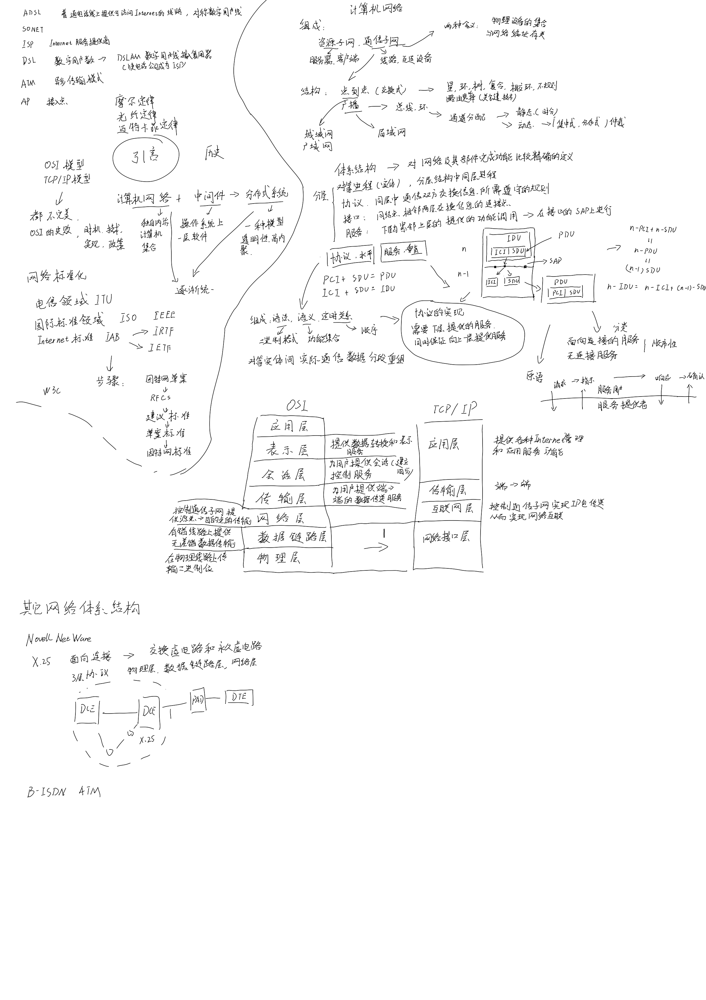
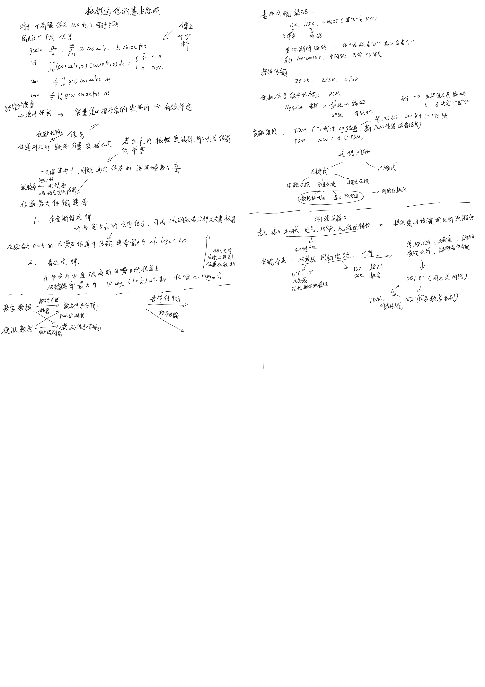
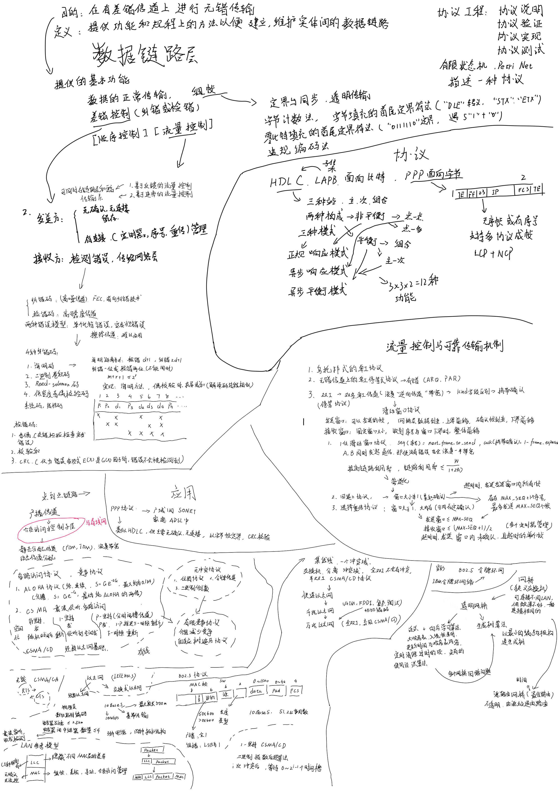
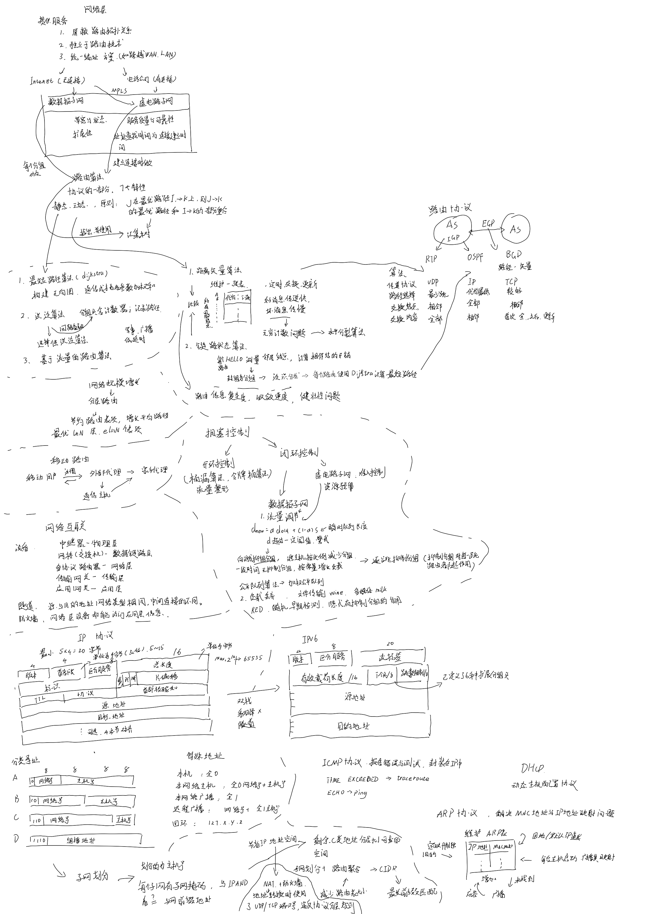
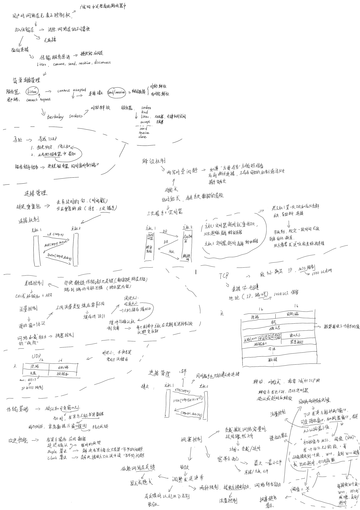
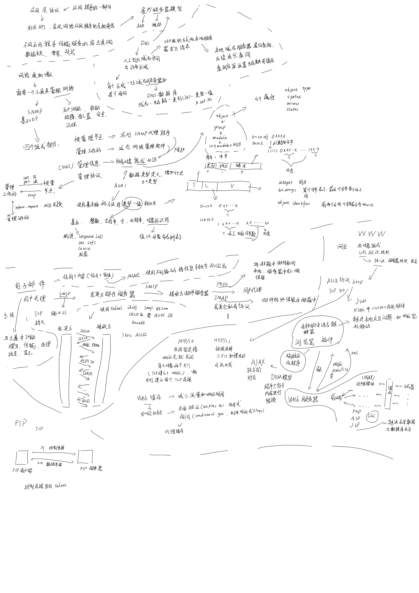

# 计算机网络

## 原理













## ELEMENTARY DATA LINK PROTOCOLS

### Some definitions needed in the protocols to follow

```c
#define MAX_PKT 1024
typedef enum
{
    false,
    true
} boolean;
typedef unsigned int seq_nr;
typedef struct
{
    unsigned char data[MAX PKT];
} packet;

typedef enum
{
    data,
    ack,
    nak
} frame_kind;
typedef struct
{
    frame_kind kind;
    seq_nr seq;
    seq_nr ack;
    packet info;
} frame;
void wait_for_event(event_type *event);
void from_network_layer(packet *p);
void to_network_layer(packet *p);
void from_physical_layer(frame *r);
void to_physical_layer(frame *s);
void start_timer(seq_nr k);
void stop_timer(seq_nr k);
void start_ack_timer(void);
void stop_ack_timer(void);
void enable_network_layer(void);
void disable_network_layer(void);

#define inc(k)       \
    if (k < MAX_SEQ) \
        k = k + 1;   \
    else             \
        k = 0
```


### A utopian simplex protocol

```c

typedef enum
{
    frame_arrival
} event_type;
#include "protocol.h"
void sender1(void)
{
    frame s;
    packet buffer;
    while (true)
    {
        from_network_layer(&buffer);
        s.info = buffer;
        to_physical_layer(&s);
    }
}
void receiver1(void)
{
    frame r;
    event_type event;
    while (true)
    {
        wait_for_event(&event);
        from_physical_layer(&r);
        to_network_layer(&r.info);
    }
}
```

### A Simplex Stop-and-Wait Protocol for an Error-Free Channel

The only difference between *receiver1* and *receiver2* is that after delivering a packet to the network layer, *receiver2* sends an acknowledgement frame back to the sender before entering the wait loop again.

This delay is a simple example of a flow control protocol.


```c
typedef enum
{
    frame_arrival
} event_type;
#include "protocol.h"
void sender2(void)
{
    frame s;
    packet buffer;
    event_type event;
    while (true)
    {
        from_network_layer(&buffer);
        s.info = buffer;
        to_physical_layer(&s);
        wait_for_event(&event);
    }
}
void receiver2(void)
{
    frame r, s;
    event_type event;
    while (true)
    {
        wait_for_event(&event);
        from_physical_layer(&r);
        to_network_layer(&r.info);
        to_physical_layer(&s);
    }
}
```

### A Simplex Stop-and-Wait Protocol for a Noisy Channel

A positive acknowledgement with retransmission protocol.

```c
#define MAX_SEQ 1
typedef enum
{
    frame_arrival,
    cksum_err,
    timeout
} event_type;
#include "protocol.h"
void sender3(void)
{
    seq_nr next_frame_to_send;
    frame s;
    packet buffer;
    event_type event;
    next_frame_to_send = 0;
    from_network_layer(&buffer);
    while (true)
    {
        s.info = buffer;
        s.seq = next_frame_to_send;
        to_physical_layer(&s);
        start_timer(s.seq);
        wait_for_event(&event);
        if (event == frame_arrival)
        {
            from_physical_layer(&s);
            if (s.ack == next_frame_to_send)
            {
                stop_timer(s.ack);
                from_network_layer(&buffer);
                inc(next_frame_to_send);
            }
        }
    }
}
void receiver3(void)
{
    seq_nr frame_expected;
    frame r, s;
    event_type event;
    frame_expected = 0;
    while (true)
    {
        wait_for_event(&event);
        if (event == frame_arrival)
        {
            from_physical_layer(&r);
            if (r.seq == frame_expected)
            {
                to_network_layer(&r.info);
                inc(frame_expected);
            }
            s.ack = 1 − frame_expected;
            to_physical_layer(&s);
        }
    }
}
```

### A 1-bit sliding window protocol

```c
#define MAX_SEQ 1
typedef enum
{
    frame_arrival,
    cksum_err,
    timeout
} event_type;
#include "protocol.h"
void protocol4(void)
{
    seq_nr next_frame_to_send;
    seq_nr frame_expected;
    frame r, s;
    packet buffer;
    event_type event;
    next_frame_to_send = 0;
    frame_expected = 0;
    from_network_layer(&buffer);
    s.info = buffer;
    s.seq = next_frame_to_send;
    s.ack = 1 − frame_expected;
    to_physical_layer(&s);
    start_timer(s.seq);
    while (true)
    {
        wait_for_event(&event);
        if (event == frame_arrival)
        {
            from_physical_layer(&r);
            if (r.seq == frame_expected)
            {
                to_network_layer(&r.info);
                inc(frame_expected);
            }
            if (r.ack == next_frame_to_send)
            {
                stop_timer(r.ack);
                from_network_layer(&buffer);
                inc(next_frame_to_send);
            }
        }
        s.info = buffer;
        s.seq = next_frame_to_send;
        s.ack = 1 − frame_expected;
        to_physical_layer(&s);
        start_timer(s.seq);
    }
}
```

### A sliding window protocol using go-back-n

```c
#define MAX                                                \
    SEQ 7 typedef enum { frame_arrival,                    \
                         cksum_err,                        \
                         timeout,                          \
                         network layer ready } event_type; \
#include "protocol.h"
static boolean
between(seq_nr a, seq_nr b, seq_nr c)
{
    if (((a <= b) && (b < c)) || ((c < a) && (a <= b)) || ((b < c) && (c < a)))
        return (true);
    else
        return (false);
}
static void send_data(seq_nr frame_nr, seq_nr frame_expected, packet buffer[])
{
    frame s;
    s.info = buffer[frame_nr];
    s.seq = frame_nr;
}
void protocol5(void)
{
    seq_nr next_frame_to_send;
    seq_nr ack_expected;
    seq_nr frame_expected;
    frame r;
    packet buffer[MAX_SEQ + 1];
    seq_nr nbuffered;
    seq_nr i;
    event_type event;
    enable_network_layer();
    next_frame_to_send = 0;
    nbuffered = 0;
    ack_expected = 0;
    frame_expected = 0;
    while (true)
    {
        wait_for_event(&event);
        to_physical_layer(&s);
        start_timer(frame_nr);
        switch (event)
        {
        case network_layer_ready:

            nbuffered = nbuffered + 1;

            inc(next_frame_to_send);
            break;
        case frame_arrival:
            from_physical_layer(&r);

            if (r.seq == frame_expected)
            {

                to_network_layer(&r.info);
                inc(frame_expected);
            }
            while (between(ack_expected, r.ack, next_frame_to_send))
            {

                nbuffered = nbuffered − 1;
                stop_timer(ack_expected);
                inc(ack_expected);
            }
            break;
        case cksum_err:
            break;
        case timeout:

            for (i = 1; i <= nbuffered; i++)
            {

                inc(next_frame_to_send);
            }
        }
        if (nbuffered < MAX_SEQ)
            enable_network_layer();
        else
            disable_network_layer();
    }
}
```

### A sliding window protocol using selective repeat

```c
#define MAX_SEQ 7
#define NR                   \
    BUFS((MAX_SEQ + 1) / 2)  \
    typedef enum             \
    {                        \
        frame_arrival,       \
        cksum_err,           \
        timeout,             \
        network layer ready, \
        ack timeout          \
    } event_type;            \
#include "protocol.h"
boolean no_nak = true;
seq_nr oldest_frame = MAX_SEQ + 1;
static boolean between(seq_nr a, seq_nr b, seq_nr c)
{
    return ((a <= b) && (b < c)) || ((c < a) && (a <= b)) || ((b < c) && (c < a));
}
static void send_frame(frame_kind fk, seq_nr frame_nr, seq_nr frame_expected, packet buffer[])
{
    frame s;
    s.kind = fk;
    if (fk == data)
        s.info = buffer[frame_nr % NR_BUFS];
    s.seq = frame_nr;
    s.ack = (frame_expected + MAX_SEQ) % (MAX_SEQ + 1);
    if (fk == nak)
        no_nak = false;
    to_physical_layer(&s);
    if (fk == data)
        start_timer(frame_nr % NR_BUFS);
    stop_ack_timer();
}
void protocol6(void)
{
    seq_nr ack_expected;
    seq_nr next_frame_to_send;
    seq_nr frame_expected;
    seq_nr too_far;
    int i;
    frame r;
    packet out_buf[NR_BUFS];
    packet in_buf[NR_BUFS];
    boolean arrived[NR_BUFS];
    seq_nr nbuffered;
    event_type event;
    enable_network_layer();
    next_frame_to_send = 0;
    ack_expected = 0;
    frame_expected = 0;
    too_far = NR_BUFS;
    nbuffered = 0;
    for (i = 0; i < NR_BUFS; i++)
        arrived[i] = false;

    while (true)
    {
        wait_for_event(&event);
        switch (event)
        {
        case network layer ready:
            nbuffered = nbuffered + 1;
            from_network_layer(&out_buf[next_frame_to_send % NR_BUFS]);
            send_frame(data, next_frame_to_send, frame_expected, out_buf);
            inc(next_frame_to_send);
            break;
        case frame_arrival:
            from_physical_layer(&r);
            if (r.kind == data)
            {
                if ((r.seq != frame_expected) && no_nak)
                    send_frame(nak, 0, frame_expected, out_buf);
                else
                    start_ack_timer();
                if (between(frame_expected, r.seq, too_far) && (arrived[r.seq % NR_BUFS] == false))
                {
                    arrived[r.seq % NR_BUFS] = true;
                    in_buf[r.seq % NR_BUFS] = r.info;
                    while (arrived[frame_expected % NR_BUFS])
                    {
                        to_network_layer(&in_buf[frame_expected % NR_BUFS]);
                        no_nak = true;
                        arrived[frame_expected % NR_BUFS] = false;
                        inc(frame_expected);
                        inc(too_far);
                        start_ack_timer();
                    }
                }
            }
            if ((r.kind == nak) && between(ack_expected, (r.ack + 1) % (MAX_SEQ + 1), next_frame_to_send))
                send_frame(data, (r.ack + 1) % (MAX_SEQ + 1), frame_expected, out_buf);
            while (between(ack_expected, r.ack, next_frame_to_send))
            {
                nbuffered = nbuffered − 1;
                stop_timer(ack_expected % NR_BUFS);
                inc(ack_expected);
            }
            break;
        case cksum_err:
            if (no_nak)
                send_frame(nak, 0, frame_expected, out_buf);
            break;
        case timeout:
            send_frame(data, oldest_frame, frame_expected, out_buf);
            break;
        case ack timeout:
            send_frame(ack, 0, frame_expected, out_buf);
        }
        if (nbuffered < NR_BUFS)
            enable_network_layer();
        else
            disable_network_layer();
    }
}
```

## SMTP 实验

dogtorhuang@foxmail.com -> hrz_ms@outlook.com

**base64编码**

用户名如下，密码同理。

```sh
echo -n "dogtorhuang" | base64
ZG9ndG9yaHVhbmc=
```

**telnet**

```sh
telnet smtp.qq.com 25
Trying 14.18.175.202...
Connected to smtp.qq.com.
Escape character is '^]'.
220 newxmesmtplogicsvrszb7.qq.com XMail Esmtp QQ Mail Server.
HELO hrz
250-newxmesmtplogicsvrszb7.qq.com-11.176.226.127-42011439
250-SIZE 73400320
250 OK
AUTH LOGIN
334 VXNlcm5hbWU6
ZG9ndG9yaHVhbmc=
334 UGFzc3dvcmQ6
c2pjdnFrcnNmZHRuYmVoaQ==
235 Authentication successful
MAIL FROM:<dogtorhuang@foxmail.com>
250 OK.
RCPT TO:<hrz_ms@outlook.com>
250 OK
DATA
354 End data with <CR><LF>.<CR><LF>.
FROM: dogtorhuang@foxmail.com
To: hrz_ms@outlook.com
Subject: confirm information
Hi, Michael

I got your message.
Looking forward to meeting you.

Thanks & Best Regards.
.
250 OK: queued as.
```


