# 硬件基础

## 计算机的指令系统

指令功能：数据运算、数据传输、输入输出指令、控制指令、其他
指令格式：指令字(操作码+操作数地址)

## 数据表示及检错纠错

### 分类

- 逻辑型
- 字符型
- 数值型

### 整数的编码

原码、反码和补码(正数一致,零的原码和反码均有 2 个编码,补码只 1 个码)

- 原码(Sign Magnitude)：符号位||数的绝对值
- 反码(One’s Complement)：符号位||数值按位求反
- 补码(Two’s Complement)：反码的最低位+1(不同位数补码相加减时,要符号扩展)
  - 补码加法：[x+y]补=[x]补+[y]补
  - 补码减法：[x-y]补= [x+(-y)]补= [x]补+[-y]补
  - [-x] 补 ：[x] 补 连同符号位在内,逐位求反,再在最低位加 1
  - [x/2] 补 ：[x] 补 算术右移 1 位

数据以字节为单位存储

- 大端：数据的低位保存在内存的高地址字节中。
- 小端：数据的低位保存在内存的低地址字节中。（以小端机为主）

### 纠检错码

块码，$(n,m)$码，数据位为 $m$，校验位为 $r=n-m$。

可能发生 $d$ 位错，需要码距为 $d+1$ 的检错码或 $2d+1$ 的纠错码。

- 奇偶校验码：用于并行数据传送中，码距为 $2$​。

- 汉明校验码：用于并行数据传送中 $2^r \ge m+r+1$，码距为 $4$​​，偶校验编解码都直接异或。

  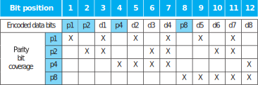

  - 若要实现纠一位错，且同时发现两位错，可再加一位总校验位，译码后总校验位为 $0$ 说明有两位错。

- 循环冗余校验码：用于串行数据传送中

  - 接受双方商定一个生成多项式 $G(x)$​，在帧的尾部附加一个校验和,使得附加之后的帧所对应的多项式能够被 $G(x)$ 除尽。当接收方收到了带校验和的帧之后,它试着用$G(x)$​去除它。如果有余数的话,则表明传输过程中有错误。
  - 如 $G(x)=x^4+x+1$​，帧为 $1101011111$​​ 

  

## 算术运算及电路实现

### ALU

#### 基于一位加法器实现

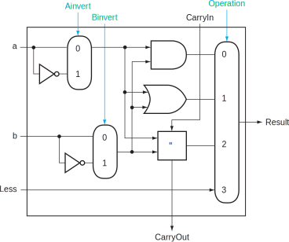

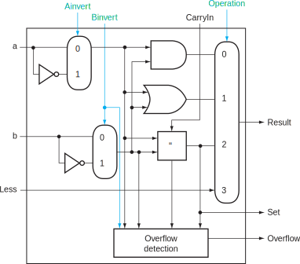

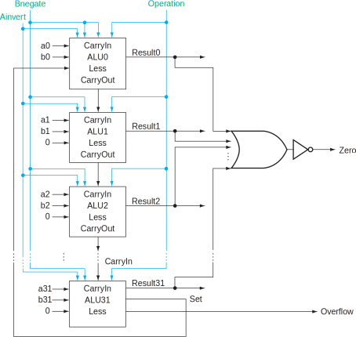

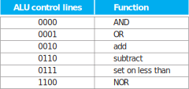

#### 基于超前进位器

$P_i=a_i+b_i$，$G_i=a_ib_i$​，$P^*$ 和 $G^*$ 用于级联更高位的进位器。

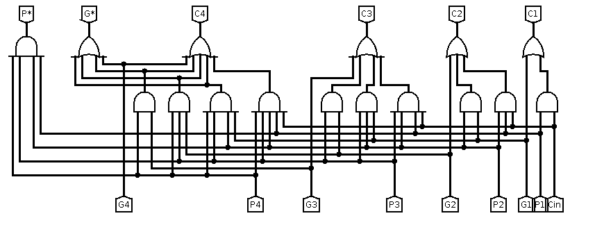

### 乘法

#### 原码

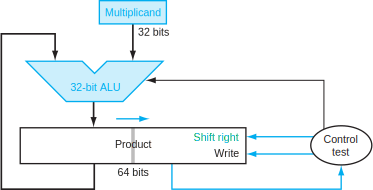

#### 补码

dsapp：补码在不溢出的情况下，可以用直接使用原码的乘法来代替。

布斯算法：

令 $[x]_{\text{补}}=x_{n-1}\cdots x_0$，$[y]_{\text{补}}$同理，则：
$$
[x\cdot y]_{\text{补}}=[x]_{\text{补}}\cdot\sum_{i=0}^{n-1}(y_{i-1}-y_i)
$$
其中 $y_{-1}=0$，即初始化附加位。

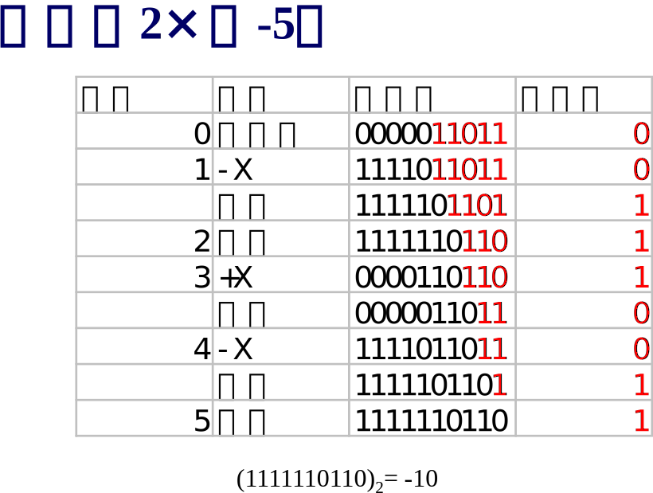

### 除法

#### 原码

$$
[x/y]_{\text{原}}=(x\oplus y)(|x|/|y|)
$$

- 恢复余数法：被除数-除数,若结果>=0,则上商1,移位;若结果<0,则商0,恢复余数后,再移位;

- 加减交替除法

  - $x=-0.1101$，$y=0.1011$

    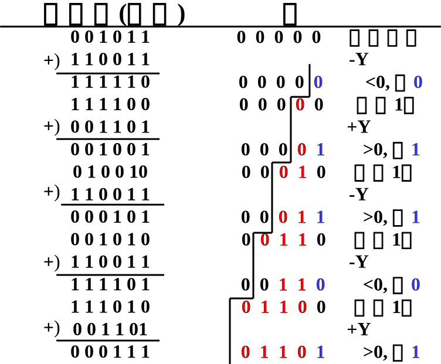

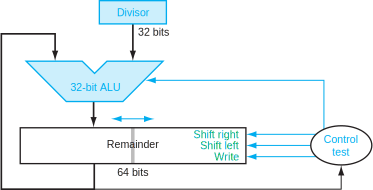

### 浮点数

#### IEEE

$$
V = (-1)^s \times M \times 2^E
$$

```
// s-exp-frac 
//Single precision k = 8, n = 23, Bias = 127
//Double precision k = 11, n = 52, Bias = 1023
```

等于 $1$ 指全 $1$，等于 $0$ 指全 $0$。

1. Normalized Values
$$
e \neq 0\neq 2^k - 1\\
M = 1 + f, E = e - Bias
$$

2. Denormalized Values
$$
e = 0\\
M = f, E = 1 - Bias
$$

3. Special Values

$$
NaN: e = 1, f \neq 0\\
\infty: e =1, f = 1
$$

- 浮点加、减法不满足结合律
- 浮点数加法、减法不可结合
- 浮点数也不能进行相等比较

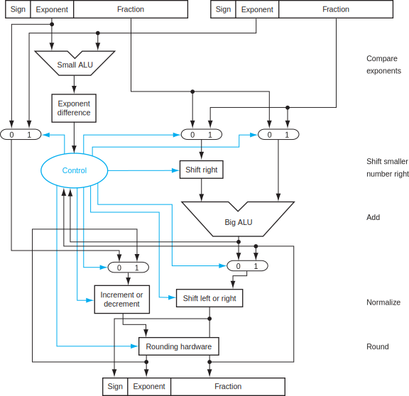

