# MIPS CPU

## 指令


| 类型 |       代表指令        |              作用              |
| :--: | :-------------------: | :----------------------------: |
|  R   |  `add $rd, $rs, $rt`  |       `$rd = $rs + $rt`        |
|  I   | `addi $rt, $rs, imm`  |       `$rt = $rs + imm`        |
|  I   |         `beq`         | `if ($rt==$rs) PC+=4+(imm<<2)` |
|  I   | `lw/sw $rt, imm($rs)` |                                |
|  J   |       `j addr`        |  `PC=PC&0xf0000000|(addr<<2)`  |

## 单周期

- 指令周期长，所有指令必须使用最长周期(lw)
- 各部件利用率低

### 控制器

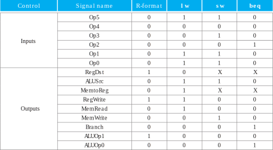

### 数据通路

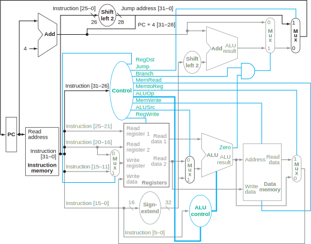

|    器件     |    端口    |           可能值           |
| :---------: | :--------: | :------------------------: |
|  Registers  | Write reg  |        rt(I), rd(R)        |
|             | Write data | `$rs+$rt`(R), mem data(lw) |
|     ALU     |            |      `$rt`(R), imm(I)      |
| Data memory |  Address   |        `imm+$rs`(I)        |
|             | Write data |         `$rt`(sw)          |

## 多周期

- 按指令的执行划分多个周期，不同指令周期数不同
- 指令串行执行
- 利用率依然偏低

### 数据通路

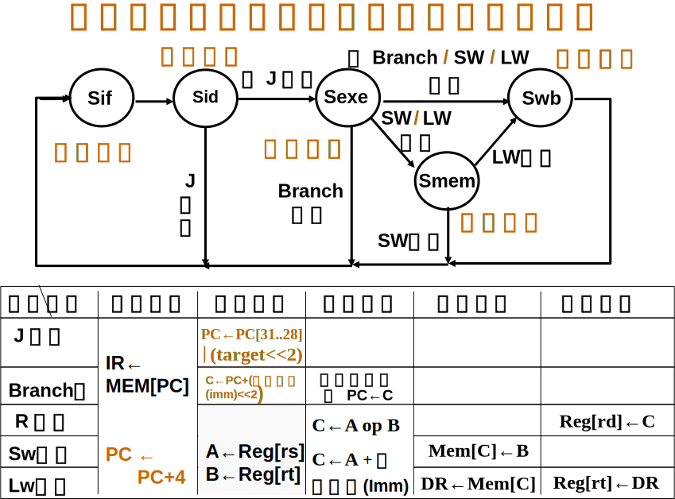

## 流水线技术

- 在流水线的各个流水段之间加入了被称为流水线寄存器(流水线锁存器)的寄存器堆。
- PC值多路选择器被移到IF段，保证对PC值的写操作只出现在一个流水段内。
- 每条指令都只在一个流水段上是活动。

### 结构冲突

因资源冲突而无法使用某种指令组合

- 暂停流水线执行,插入等待周期
- 增加资源,解决资源冲突

### 数据冲突

- 写后读冲突
- 写后写冲突
- 读后写冲突

MIPS指令流水无后两种冲突，在ID段完成所有读操作，WB段所有写操作。

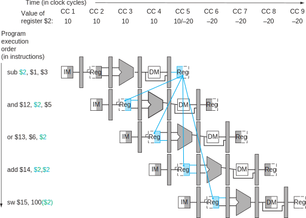

CC2, CC3发生写后读冲突。

#### 旁路技术

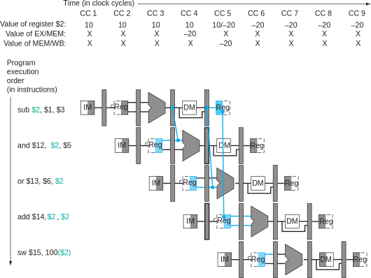

- 检测

Rd可能是原指令的rt或rd值。

```
// R型指令
1a. EX/MEM.RegisterRd = ID/EX.RegisterRs
1b. EX/MEM.RegisterRd = ID/EX.RegisterRt
// R型指令，或lw隔一周期后R型指令
2a. MEM/WB.RegisterRd = ID/EX.RegisterRs
2b. MEM/WB.RegisterRd = ID/EX.RegisterRt
```

- 旁路单元

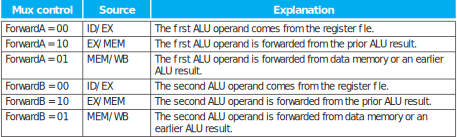

1. EX hazard:

```
if (EX/MEM.RegWrite
and (EX/MEM.RegisterRd ≠ 0)
and (EX/MEM.RegisterRd = ID/EX.RegisterRs)) ForwardA = 10
if (EX/MEM.RegWrite
and (EX/MEM.RegisterRd ≠ 0)
and (EX/MEM.RegisterRd = ID/EX.RegisterRt)) ForwardB = 10
```

2. MEM hazard:

```
if (MEM/WB.RegWrite
and (MEM/WB.RegisterRd ≠ 0)
and not(EX/MEM.RegWrite and (EX/MEM.RegisterRd ≠ 0)
and (EX/MEM.RegisterRd ≠ ID/EX.RegisterRs))
and (MEM/WB.RegisterRd = ID/EX.RegisterRs)) ForwardA = 01
if (MEM/WB.RegWrite
and (MEM/WB.RegisterRd ≠ 0)
and not(EX/MEM.RegWrite and (EX/MEM.RegisterRd ≠ 0)
and (EX/MEM.RegisterRd ≠ ID/EX.RegisterRt))
and (MEM/WB.RegisterRd = ID/EX.RegisterRt)) ForwardB = 01
```

#### 暂停

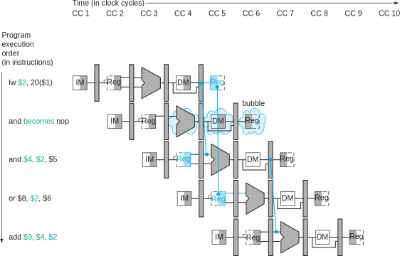

```
if (ID/EX.MemRead and
((ID/EX.RegisterRt = IF/ID.RegisterRs) or
(ID/EX.RegisterRt = IF/ID.RegisterRt)))
stall the pipeline
```

暂停：

- 当前指令控制信号为０
- PC，IF/ID值不变

#### 静态调度与动态调度

动态调度并不能真正消除数据冲突，但它能在出现数据冲突时尽量避免出现处理器暂停。而静态调度方法
则是尽量通过分离有冲突问题的指令使它们不会导致冲突，从而减少暂停的影响。

#### 数据通路

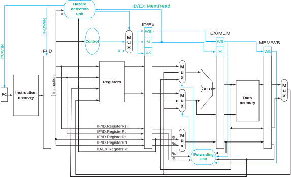

### 控制冲突

#### 暂停流水线

尽早判断分支转移是否成功，尽早计算成功转移的PC值

##### 数据通路

在ID段增加比较器，完成源操作数的比较，调整加法器到ID段，完成转移地址的计算。

- 若相等则转移
  - PCsrc选择转移目标地址(PC=目的地址)
  - 清除IF/ID段寄存器的值(IF/ID寄存器=NOP)
  - 当前指令的控制信号为0(ID/EX寄存器=0)
- 若不等，则顺序执行
  - PCsrc选择顺序执行(PC=PC+4)
  - 保留IF/ID段寄存器的值(IF/ID寄存器=BEQ的后一条指令)
  - 当前指令的控制信号为0(ID/EX寄存器=0)

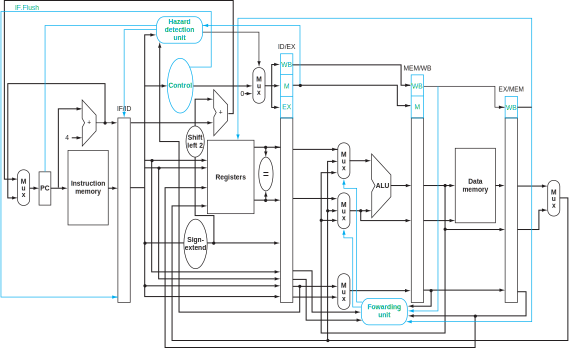

由于beq和前一条指令可能存在数据冲突，所以数据旁路还需要提前。

### 分支预测

#### 预测成功，预测不成功

上图实际上是预测不成功的一种实现。

#### 动态预测

硬件根据上次分支的结果进行本次预测

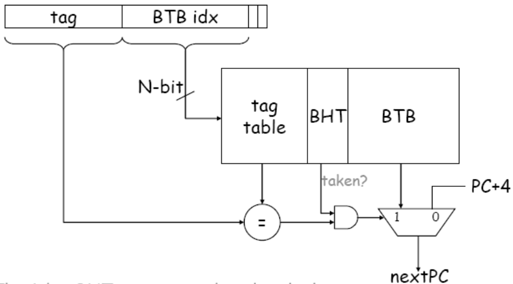

可增加至２位预测位。

#### 编译器处理

延迟槽

## 异常

- 增加异常原因寄存器，保存异常的原因
- 发现异常

###　单周期，多周期

在每条指令结束时，增加一个检查异常（中断）是否发生的步骤

### 流水

- 处理要求
  - 指令流水线中有5条指令正在执行
  - 判断发生异常的位置
  - 保留发生异常的现场
  - 执行异常处理程序
- 硬件
  - EPC
  - Cause
- MIPS CP0

如下图为在EX阶段增加一个异常检测的数据通路，若发生异常，还需将IF/ID写入nop，ID/EX，EX/MEM的控制信号写0。

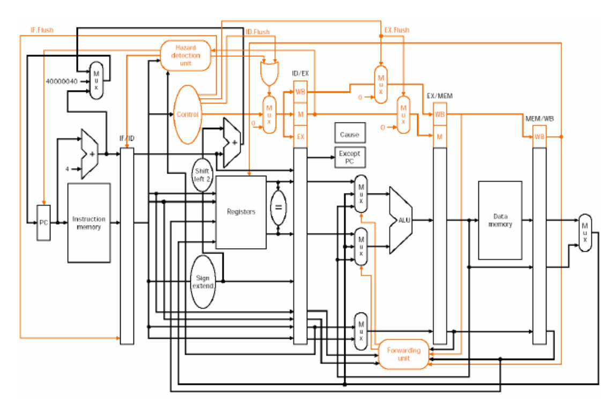

