# 存储器与IO

## 层次存储器系统

程序运行的局部性原理

- 时间局部性:最近被访问过的程序和数据很可能再次被访问
- 空间局部性:CPU 很可能访问最近被访问过的地址单元附近的地址单元。

层次之间应满足的原则:

- 一致性原则:处在不同层次存储器中的同一个信息应保持相同的值。
- 包含性原则:处在内层的信息一定被包含在其外层的存储器中,反之则不成立。

总线：

- 地址总线用于选择主存储器的一个存储单元(字或字节),其位数决定了能够访问的存储单元的最大数目,称为最大可寻址空间。
- 数据总线用于在计算机各功能部件之间传送数据,其位数(总线的宽度)与总线时钟频率的乘积,与该总线所支持的最高数据吞吐(输入/输出)能力成正比。
- 控制总线用于指明总线的工作周期类型和本次入/出完成的时刻。

### 动态存储器 DRAM，静态存储器

动态存储器：用金属氧化物半导体(MOS)的单个 MOS 管存储一个二进制位(bit)信息。信息被存储在 MOS 管 T 的源极的寄生电容 C S 中,有电荷表示 1,无电荷表示 0。

|      | 存储信息 | 送行列地址 | 集成度 | 发热量 |
| ---- | -------- | ---------- | ------ | ------ |
| SRAM | 触发器   | 同时       | 低     | 大     |
| DRAM | 电容     | 分两次     | 高     | 小     |

### 高速缓冲存储器 Cache

主存和 CPU 之间的存储器,用高速的静态存储器实现,缓存了CPU 频繁访问的信息。高速,透明。

Cache 接入系统的体系结构：侧接法，隔断法

要解决的问题

1. 地址之间的映射关系:如何根据主存地址得到 Cache 中的数据?
2. 数据之间一致性:Cache 中的内容是否已经是主存对应地址的内容?
3. 数据交换的粒度:Cache 中的内容与主存内容以多大的粒度交换?
4. Cache 内容装入和替换策略:如何提高 Cache 的命中率?

$$
\text{平均访问时间}=HR*\text{命中时间}+(1-HR)*\text{失效损失}
$$

$HR$ 为命中率。

#### 地址之间的映射关系

全相联方式

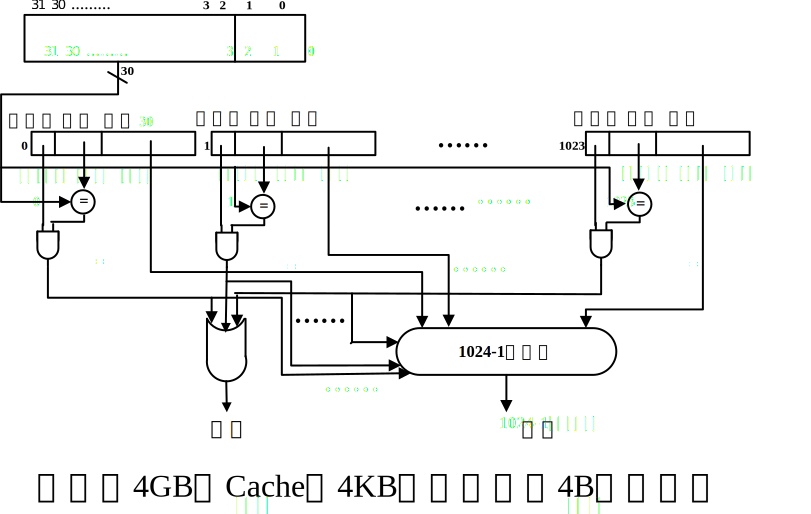

直接映射

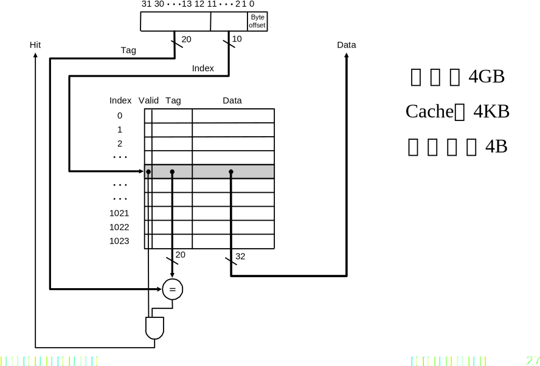

多路组相联

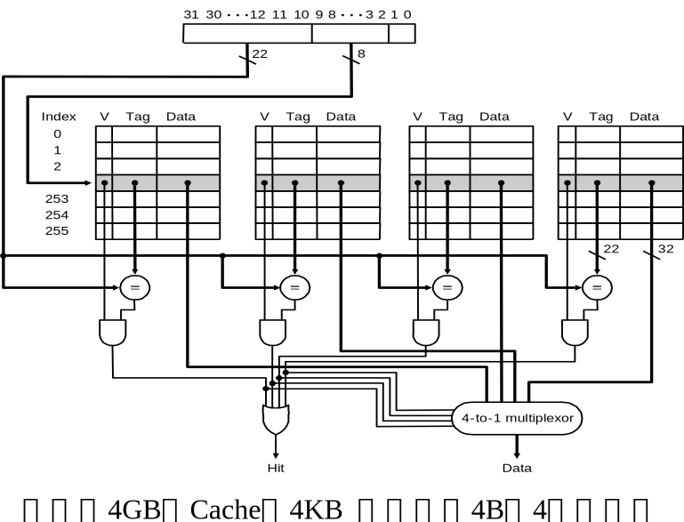

#### 一致性保证

Cache（不命中）写

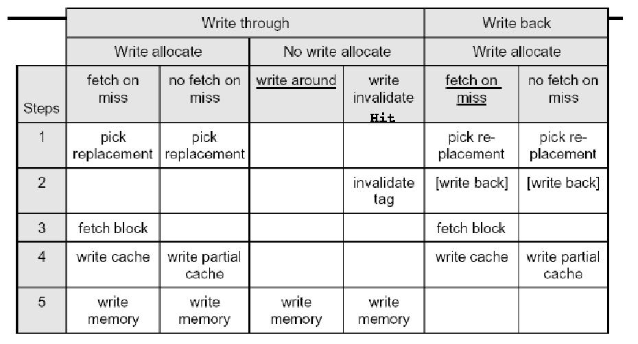

#### 提高 Cache 的命中率

- 必然缺失 Compulsory Miss(开机或者是进程切换、首次访问
  数据块)
- 容量缺失 Capacity Miss(活动数据集超出了 Cache 的大小)
- 冲突缺失 Conflict Miss (多个内存块映射到同一 Cache 块、某一 Cache 组块已满但空闲的 Cache 块在其他
  组)
- 无效缺失(其他进程修改了主存数据)

替换算法:最近最少使用的(LRU)、先进先出(FIFO)、随机替换(RAND)

### 虚拟存储器

| 虚存                                            | Cache                                                        |
| ----------------------------------------------- | ------------------------------------------------------------ |
| 主要目的是实现存储管理,帮助解决存储容量的问题。 | 主要目的是解决存储速度问题,使存储器访问速度不太影响 CPU 的运行速度。 |
| 单位时间内数据交换次数少,每次交换数据量大       | 单位时间内数据交换的次数多,每次交换数据量小                  |
| 由操作系统管理                                  | 由硬件实现                                                   |

#### 虚拟存储器管理

- 段式存储管理

以段作为存储管理的对象,段长动态可变,段起点、终点不定。易于编译、管理、修改、保护和共享,空间分配困难,容易产生碎片。

段(Segment)程序模块化设计的结果(过程、函数、数组、...),逻辑上相对独立,是共享和保护的最小单元。

实现:设置段表进行管理,段表基地址,段起始地址,段长,装入位,保护、共享等标志。

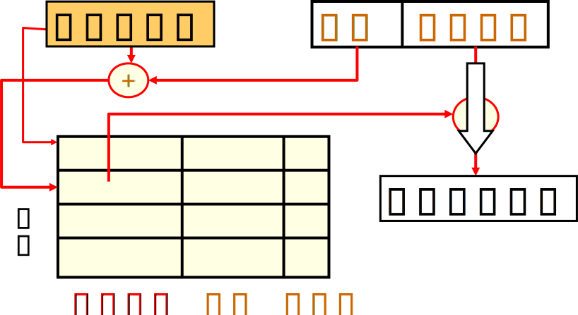

- 页式存储管理

将主存和虚存划分为固定大小的页,以页为单位进行管理和数据交换。

虚地址=虚页号+页内地址;实地址=实页号+页内地址。

实现:通过页表进行管理,页表基地址寄存器,实页号,控制位。

页式虚拟存储器的访问过程:

1. 得到程序给出的虚地址;
2. 由虚地址得到虚页号;
3. 访问页表,得到对应的实页号;
4. 若该页已在内存中,则根据实页号得到实地址,访问内存;
5. 否则,启动输入输出系统,读出对应页装入主存,再进行访问。

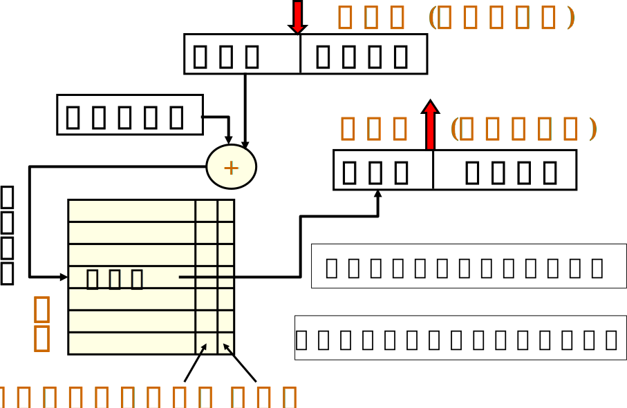

#### 转换旁路缓冲(TLB)

为页表设置的专用 Cache,高效实现虚页号到实页号的转换,容量较小,128~256 个表项。

TLB 缺失:流水线停,通知操作系统,读页表,将表项写入 TLB,返回用户程序,重新访问。

页面大小:缩小页面大小可减少内部碎片,但需更大的页表。

页面替换算法:最近最少使用(LRU)

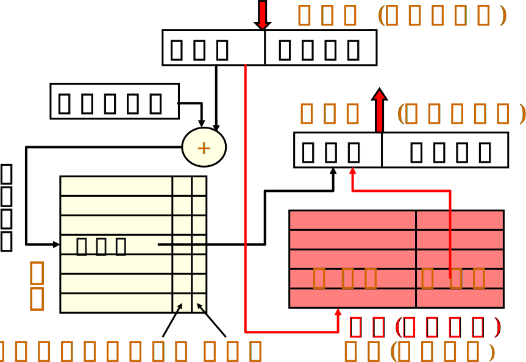

#### Pentium 的虚存管理

程序员给出的虚拟地址,格式为段号+段内偏移(16位+32位),每段大小不超过4GB。

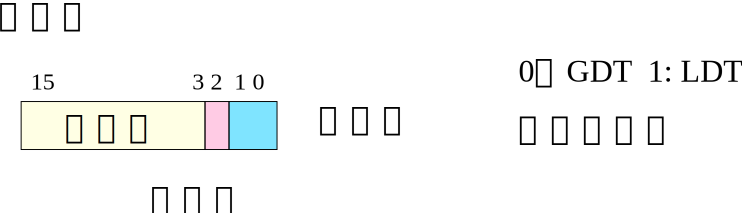

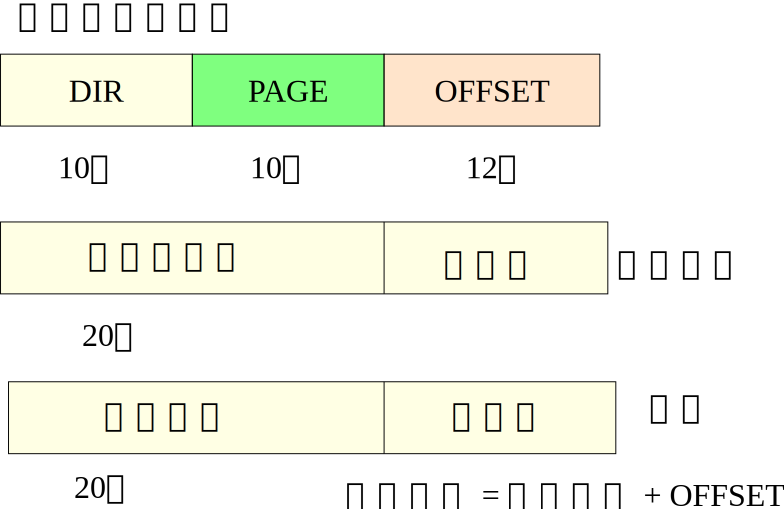

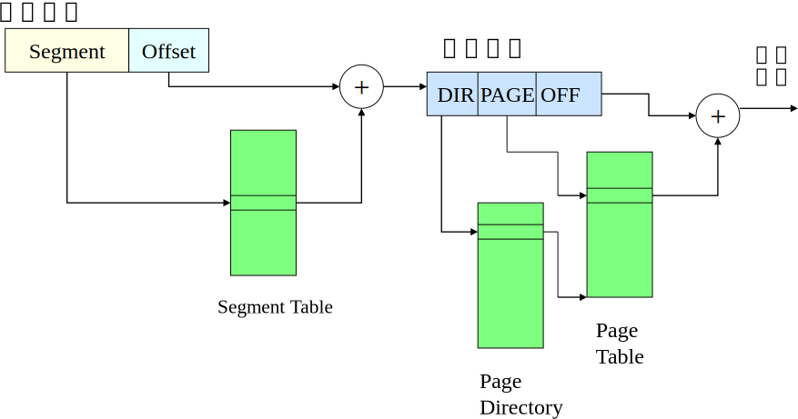

### 磁表面存储设备

容量大,成本低,断电保存,脱机保存,串行访问,数据交换频率低,数
据交换量大。一般为磁盘、光盘等。

- 随机访问

随机访问任何单元,访问时间与存放位置无关,每一位都有各自的读写设备。

- 串行访问

顺序按位进行,访问时间与存储位的物理位置有关,共用一个读写设备。

- 主要指标

存储密度,存储容量,寻址时间,数据传输率,误码率,价格。

#### 磁记录方式

一种编码方法,即如何将一串二进制信息,通过读写电路变换成磁层介质中的磁化翻转序列。(编码效率,自同步能力,读写可靠性)

归零制(RZ),不归零制(NRZ),见 1 翻转的不归零制(NRZ1),调相制(PM),调频制(FM),改进的调频制(MFM)

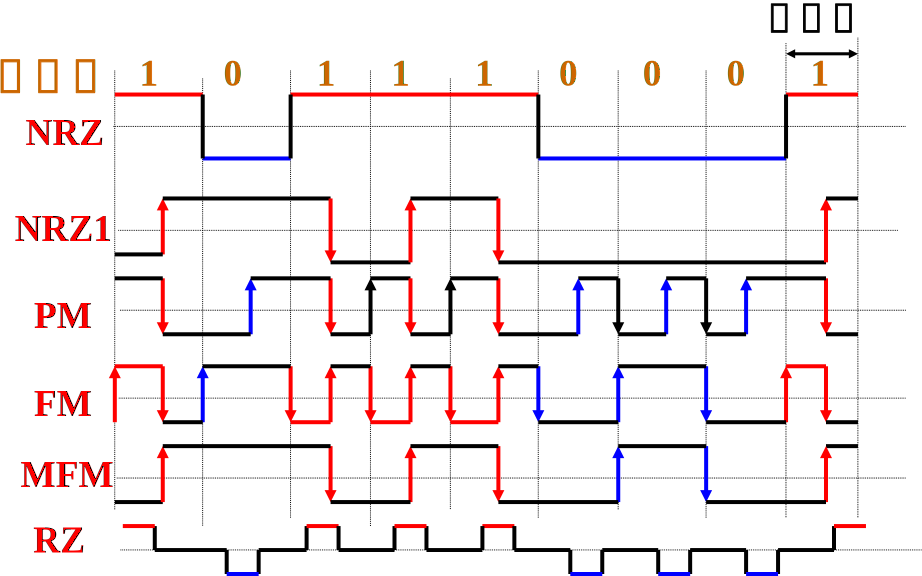

#### 磁盘

磁盘访问时间= 寻道时间+ 平均旋转延迟+ 传输时间+ 磁盘控制器延迟

例:平均寻道时间= 12ms,旋转速度= 5400rpm,磁盘控制器延迟=2ms,传输速度=5MB,扇区大小= 512 bytes,页大小 8KB。

旋转 1 周: 1/5400 minutes = 11.1ms => 1/2 周:5.6 ms

读 1 个扇区:12ms + 5.6ms + .5K/5MB s+ 2ms = 12 + 5.6 + .1ms + 2ms = 19.7ms

读 1 页的时间:12 ms + 5.6ms + 8K/5MB s + 2ms = 12ms + 5.6ms + 1.6ms + 2ms = 21.2 ms

采用流水方式和大容量传输方式(每次读取多个扇区)克服磁盘控制器延迟。

额外开销在总开销中比例较大 => 一次传输大量数据比较有效。

将页面存放在相邻扇区中可以避免额外的寻道开销。

#### RAID 技术

- 可靠性(reliability):设备出现故障的几率来衡量。
- 可用性(availability):系统能正常运行的几率来衡量。

出故障后仍能运行。

目标: N 个磁盘的容量, 1/N 的访问时间,更高的性价比,用冗余技术提高存储信息可用性。提高磁盘的可用性和性能

- raid0

- raid1

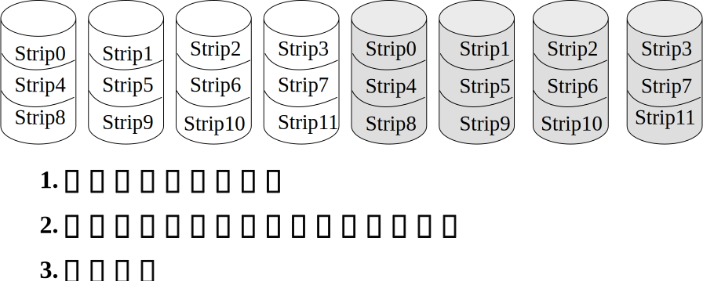

- raid2

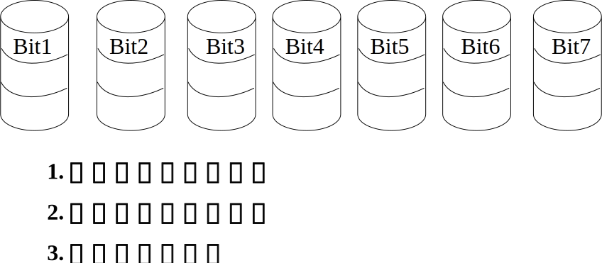

- raid3

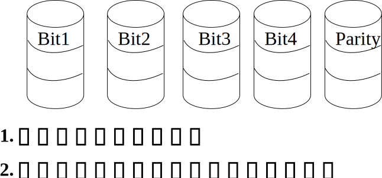

- raid4

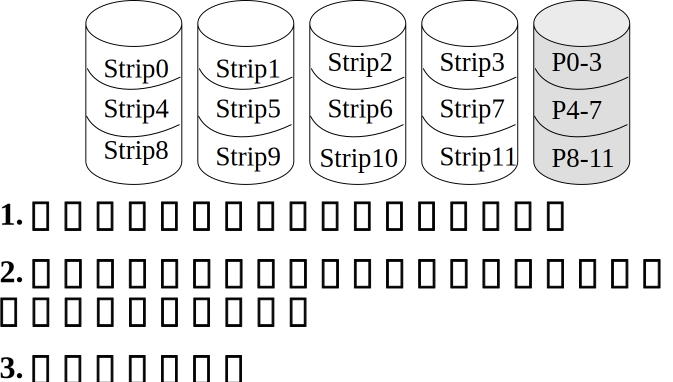

- raid5

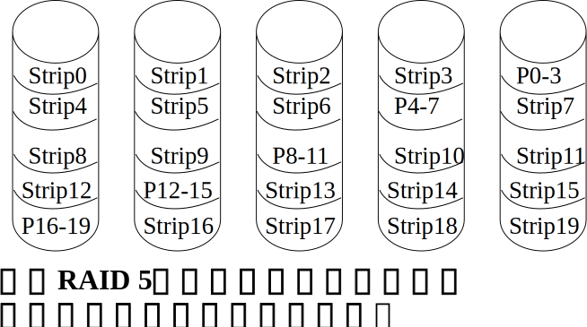

## 输入/输出系统

- 要解决的问题

控制方式:CPU 如何控制输入/输出?(输入/输出方式)

传输方式:传输通道、方式、速率等(总线、接口)

数据识别和转换:数/模转换、语音识别等,转为字符、数据等计算机能识别的格式(设备)。

### 输入/输出方式

- 程序直接控制

CPU 直接使用输入/输出指令来控制外部设备。

CPU 方查询接口状态(循环等待),直到外设已经接收到该字符,读字符;外设方往接口数据缓冲中送字符,处理完后,置状态寄存器,等待下一个字符。

- 程序中断

外部设备请求,CPU 暂停正在执行的程序并响应,CPU 与外设并行工作,完成后继续执行原来的程序。有中断优先级。

中断源:外中断(I/O 设备等),异常(内中断:处理器硬件故障、程序“出错”,Trap),中断触发器,中断状态寄存器。

完整过程:中断请求(中断源设备设置中断触发器),中断响应(响应条件:允许中断、当前指令结束、优先级,响应实现:硬件实现的中断隐指令,保存断点),中断处理(保存现场信息,运行中断服务程序,中断返回)。

关中断;保存断点;判中断源,转中断服务;开中断;执行中断服务程序;关中断;恢复断点;开中断;返回断点

- 直接存储访问(DMA)

I/O 设备和主存储器之间的直接数据通路,为专设的硬件,用于高速 I/O 设备和主存储器之间成组传送数据。

数据传送开始前和结束后通过程序或中断方式对 DMA 进行预处理和后处理。

DMA 工作方式:独占总线方式,周期窃取方式。

Cache 一致性:主存中的数据可能不是最新的,采用直接写会带来性能的降低,DMA 查询Cache 会降低性能,直接设计硬件控制。

- 通道 I/O

通道是系统中代替 CPU 管理控制外设的独立部件,能执行有限 I/O 指令集合。

通道类型:字节多路通道(简单的共享通道,分时处理,面向低、中速字符设备);选择通道(选择一台外设独占整个通道,以成组传送方式传送数据块,效率高,适合快速设备);数组多路通道(上两种方式的结合,效率高,控制复杂)

- 外围处理机

通道型处理机:共享内存

### 总线

#### 分类

- 处理器-主存总线(专用)
  - 传输距离短、速度高,主存储器专用
  - 直接和处理器连接
  - 直接和处理器连接
- 输入 / 输出总线(行业标准)
  - 通常距离较长,速度较慢
  - 需要适应多种输入/输出设备
  - 和处理器-主存总线通过桥连接(或通过主板总线)
- 主板总线(行业标准或专门设计)
  - 主板:连接各部件器件的底盘
  - 应允许处理器、主存储器和输入/输出设备互连
  - 应有价格优势:所有组件连接在一条总线上

#### 组成

控制线:标记总线事务的开始和结束,指明数据线上传输信息的类型。

数据线:在源设备和目标设备间传送信息。

- 相关概念:

总线主设备:有能力控制总线,发起总线事务

总线从设备:响应主设备请求

总线通信协议:定义总线传输中的事件顺序和时序要求

异步总线传输:控制信号(请求,应答)作为总控信号

同步总线传输:使用共同的时钟信号

总线事务:发起命令(和地址),传输数据。

#### 总线仲裁

问题:如何为需要使用总线的设备安排总线?

可通过主—从设备的安排来避免冲突:只允许主设备发起总线事务,控制所有总线请求,从设备响应主设备的读写请求。

最简单的设计:处理器作为唯一的总线主设备,所有总线请求均由处理器控制,主要缺点是处理器被卷入到每一个总线事务中。

总线仲裁的基本要求:某总线主设备使用总线前应发出总线请求,只有得到授权后,主设备才能使用总线,使用完毕后,主设备应通知仲裁器。

总线仲裁方式:

- 集中仲裁
  - 菊链仲裁(所有设备共用一个总线请求信号)
    - 简单
    - 无法保证公平性,低优先级设备可能得不到总线使用权
    - 总线授权信号的逐级传递限制了申请总线的速度。
  - 集中平行仲裁(通过集中的仲裁器进行)
    - 用于几乎所有处理器-主存总线和一些高速输入/输出总线。
- 分布仲裁 
  - 通过自我选择进行分布式仲裁(每个要使用总线的设备将自己的标识放在总线上)。
  - 碰撞检测(以太网)

#### 通信方式
- 同步总线:控制线中包含有一根时钟信号线,传输协议根据时钟信号制定。
  - 例如:主设备提出总线请求后 5 个时钟周期,可以获得能否使用总线的信号。
  - 优点:逻辑简单、高速。缺点:总线上设备须按时钟频率工作,为防止时钟信号扭曲,高速工作时总线距离须够短。

- 异步总线:不使用统一的时钟,可适应设备的不同速度,不用担心时钟信号扭曲,距离可较长,使用握手协议。

**增加总线带宽**

- 增加总线的宽度:可增加每个周期传送数据的量,提高了成本。

- 分别设置数据总线和地址总线:可同时传送数据和地址,提高了成本。

- 采用成组传送方式:一个总线事务传送多个数据,每次只需要在开始的时候传送一个地址,直到数据传送完毕才释放总线,复杂度提高,延长后续总线请求的等待时间。

**多主设备总线提高事务数量**

仲裁重叠:在当前事务时,为下一总线事务进行仲裁。

总线占用:没有其他主设备请求总线的情况下,某主设备一直占用总线,完成多个总线事务。

地址、数据传送重叠。

### 接口电路和外部设备

- 提供主机识别(指定、找到)使用的 I/O 设备的支持:为每个设备规定几个地址码或编号。
- 建立主机和设备之间的控制与通信机制:接收处理器(主设备)的命令,并提交给外部设备,同时,为主设备提供外部设备的状态。
- 提供主机和设备之间信息交换过程中的数据缓冲机构。
- 提供主机和设备之间信息交换过程中的其他特别需求支持:屏蔽外部设备的差异。

