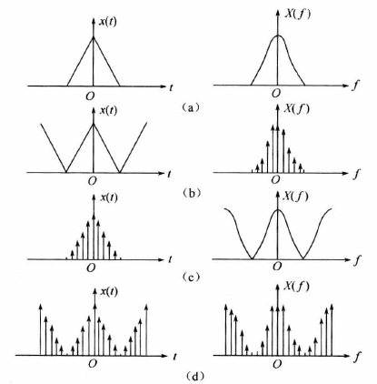

# 数字信号处理

## 傅里叶变换

1. 连续信号频谱非周期，离散信号频谱周期
2. 离散周期信号频谱离散周期

## 常用的z变换

<table>
    <tr>
        <td>$a^n u(n)$</td>
        <td>$\frac{1}{1-az^{-1}}$</td>
        <td>$|z|>|a|$</td>
    </tr>
    <tr>
        <td>$a^n u(-n-1)$</td>
        <td>$\frac{-1}{1-a^{-1}}$</td>
        <td>$|z|<|a|$</td>
    </tr>
</table>

## 内插公式

时域采样：

$$
x_a(t) = \sum_{n = -\infty}^{\infty} x_a(nT)h(t-nT) = \sum_{n = -\infty}^{\infty} x_a(nT)\frac{sin[\pi(t-nT)/T]}{\pi(t-nT)/T}
$$

频域采样：

$$H(z) = \frac{1-z^{-N}}{N}\sum_{k = 0}^{N-1} \frac{H(k)}{1-W_N^{-k}z^{-1}}$$

$$H(e^{j\omega}) = \sum_{k = 0}^{N-1}\phi(\omega-\frac{2\pi}{N}k)$$

式中$\phi(\omega)$为内插函数：

$$\phi(\omega) = \frac{1}{N}\sum_{k = 0}^{N-1} \frac{sin(N\omega/2)}{\omega/2} e^{j\omega(\frac{N-1}{2})}$$

## IIR数字滤波器

### 脉冲响应不变法

$$H_a(s) = \sum_{k = 1}^N \frac{A_k}{s-s_k} \rightarrow H(z) = \sum_{k = 1}^N \frac{TA_k}{1-e^{s_kT}z^{-1}}$$

### 双线性变换法

压缩：

$$\Omega = c \cdot tan(\frac{\omega_1 T}{2})$$

s平面到z平面单值映射：

$$s = \frac{1-z^{-1}}{1+z^{-1}}$$

## FIR数字滤波器设计方法

窗函数法；从时域出发，把理想的$h_d(n)$用一定形状的窗函数截取成有限长的$h(n)$，以此来逼近理想的$h_d(n)$，得到的频率响应逼近理想的$H_d(e^{j\omega})$

频率采样法：从频域出发，把给定的$H_d(e^{j\omega})$等间隔采样，即

$$H_d(e^{j\omega})|_{\omega = \frac{2\pi k}{N}} = H_d(k)$$

然后以此$H_d(k)$作为实际FIR数字滤波器的频率特性采样值$H(k)$，即令

$$H(k) = H_d(k)\qquad,k = 0,1,\cdots ,N-1$$

再利用内插公式使$H(z)$逼近$H_d(z)$

### 窗函数法

窗函数要求：
1. 主瓣尽可能窄，以获得较陡的过渡带
2. 尽量减少窗谱最大旁瓣的相对幅度，使能量尽量集中于主瓣

四种线性相位的FIR滤波器：
1. $h(n)$为奇（偶）对称，$H(\omega)$关于$0 ,2\pi$奇（偶）对称
2. $N$为基数，不影响$\pi$对称性，偶数影响

## 多采样率数字信号处理

抽取：

$$Y(z) = \frac{1}{M} \sum_{k = 0}^{M-1}X(e^{j\frac{2\pi k}{M}}z^{-M})$$

内插：

$$Y(z) = X(z^L)$$