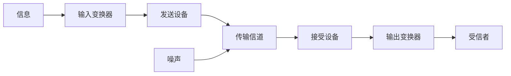
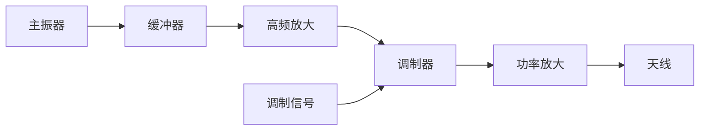
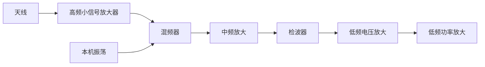

# 通信电子线路

## 绪论

### 通信系统

定义：实现信息的传输所需设备综合

组成：以上5个基本部分

输入变换器：非电量转换为基带信号。

发送设备：基带信号变换为适合信道传输的信号
两大任务：
1. 信号变换（调制）
2. 信号放大（电压和功率）

接收设备：
1. 解调
2. 选择有用信号，抑制干扰信号

分类：按信道，通信方式，传输的基带信号分

### 无线信道及传播方式

频段的划分

传播方式：地波（绕射），天波（折射和反射），直线（视距）传播，决定方式为信号的波长，长中波地波，短波天波，超短波直线

### 无线电发送设备

基本任务：以自由空间为信道，把信息变换为无线电波传送到远方

要求：远，多路传输

为什么不直接发送基带信号：
1. 基带信号是低频信号，要用很长的天线
2. 带宽不同，多路通信困难

载波调制：用基带信号去控制高频载波信号的三参量之一，使其随基波线性变化

方式：
1. 模拟调制
2. 数字调制
   

调幅广播为例，变化为：

低频部分+高频部分+天线

### 无线电接受设备

解调：检波，鉴频和鉴相

直接检波式接收机，灵敏度，选择性低

直接放大式接收机：适用于固定频率的接收

超外差接收机，同时兼顾高灵敏度和高选择性，调幅广播为例：

### 通信电子线路研究对象

发射设备和接收设备的各种高频电路

高频：几百KHz到几百MHz

## 高频基础电路

### LC串并联谐振回路

#### 高频等效：
1. 电感：理想电感与损耗电阻串联或损耗电导并联。
    $Q_0$为理想品质因数，可在工作频率下通过Q表直接测得，$Q_0 \gg 1$时，
    $$r_0=\frac{\omega_0L}{Q_0}$$
    $$g_0=\frac{1}{\omega_0LQ_0}$$
2. 电容：等效为理想电容

$Q=\frac{\omega L}{R}$，并联谐振回路$Q=\frac{R}{\omega L}=$

#### 串联谐振回路

谐振时电流最大，阻抗最小，回路品质因素越大，相对幅频特性，相对相频特性越陡，随$\omega$增加，阻抗由容抗向感抗转化

#### 并联谐振回路：
1. 空载时
$$谐振频率:\omega_p=\omega_0\sqrt{1-\frac{1}{Q_0^2}}$$
$Q_0 \gg 1$时，$\omega_p=\omega_0$，且此时有回路电阻$R_p=Q_0^2r_0$

2. 带载
加一负载，不影响谐振频率，谐振时，电阻减小，品质因素减小。

谐振时电压最大，阻抗最大，回路品质因素越大，相对幅频特性，相对相频特性越陡，随$\omega$增加，阻抗由感抗向容抗转化

#### 接入系数与变化关系

阻抗变换为除以$p^2$，导纳变换为乘以$p^2$，电压源为除，电流源为乘。

## 高频小信号放大器

功能：对微弱高频信号的不失真放大和选频滤波

特点：
1. 频率高，三极管极间电容不能忽略
2. 输入信号小，晶体管工作在线性范围
   

分类：按放大信号的带宽，按负载性质

技术指标：

$$A_u,A_p,2\triangle f_{0.7},K_{r0.1},N_F=\frac{P_{si}/P_{ni}}{P_{so}/P_{no}}$$

实际放大器矩形系数恒大于1，越小越好，噪声系数接近于1好

### 晶体管高频参数

截至频率$f_\beta$，特征频率$f_T$，最高振荡频率$f_{max}$

$$|\beta |=\frac{\beta_0}{\sqrt{1-(\frac{f}{f_\beta})^2}}$$

当$\beta  \gg  1$时，$f_T=\beta_0 f_b$

### 单调谐回路谐振放大器

分为Y参数等效电路和混合$\pi$型等效电路

#### Y参数等效电路

$y_i=\dot{I_1}/\dot{U_1}|_{U_2=0}$，输出短路输入导纳，$y_o$，输出导纳，$y_r$，反向传输导纳，$y_f$，正向传输导纳

共射电路，简化为，$y_{re}=0$

每级三极管参数都相同时，等效到谐振回路：
1. 左边：$p_1\dot{U_i}y_{fe},p_1^2g_{oe},p_1^2C_{oe}$
2. 中间：$C,g_0,L$
3. 右边：$p_2^2g_{ie},p_2^2C_{ie},\frac{\dot{U_o}}{p_2}$

由$\dot{U_o}=-\frac{p_1\dot{U_i}y_{fe}}{Y_{\Sigma}}$得：

$$\dot{A_u}=-\frac{p_1p_2y_{fe}}{Y_\Sigma}$$

谐振时最大，其中$Y_{\Sigma}=g_{\Sigma}$
相对电压增益：

$$\frac{\dot{A_u}}{\dot{A_{u0}}}=\frac{1}{1+jQ_L2\triangle f/f_0}$$

其中$Q_L=1/(\omega_0 g_{\Sigma} L)$，若$\xi=Q_L 2\triangle f/f_0$，称为广义失谐

通频带：$\triangle 2f_{0.7} = f_0/Q_L$，矩形系数：$K_{r0.1}=\sqrt{99} \gg 1$选择性差
通频带和谐振电压增益为常数

#### 多级单调谐回路谐振放大器

$$A_m=(A_{u1})^m$$

$$\frac{A_m}{A_{mo}} = \frac{1}{(1+(Q_L 2 \triangle f/f_0)^2)^{m/2}}$$

$$(2 \triangle f_{0.7})_m = \sqrt{2^{1/m}-1} (2 \triangle f_{0.7})_1$$

级数越多，通频带越窄，矩形系数越小

### 稳定性

引起不稳定的原因：$y_{re} \neq 0$，可能构成正反馈

稳定系数：$S = \dot{U_i}/\dot{U_i'}$，其中$\dot{U_i'}$为正反馈电压
S越大，越稳定，一般要求$\ge 5$

稳定电压增益：不加稳定措施，并满足S的工作于谐振频率的最大电压增益

$$|A_{u0}|=\sqrt{\frac{2|y_{fe|}}{S|y_{re}|(1+cos(\phi_{re}+\phi_{fe}))}}$$

提高稳定性措施：
1. 中和法：电流大小相同，方向相反
   只能对一个频率点起到完全中和作用
2. 失配法：实质是降低电压增益

## 高频功率放大器

功能：用小功率的高频输入信号去控制高频功率放大器将直流电源供给的能量转化为大功率高频能量输出

分类：按工作频率，按工作类型

技术指标：输出功率，效率，功率增益，谐波抑制度（非线性功放）

中间级和输出级都可等效为输入回路，非线性器件，带通滤波

特点：
1. 放大器：静态截止，动态导通和截止
2. 谐振回路：选频，阻抗匹配

### 折线分析法

三极管的三种特性曲线：输入特性，输出特性，正向传输特性

$g_r$为正向传输特性曲线斜率，$g_{cr}$输出特性曲线饱和区的斜率，其放大区间隔除以$u_{be}$变换应为$g_r$

输入信号$u_{bm}cos(\omega t)$，$\omega t = 0$时，$i_c$最大，$\omega t = \theta_c$时，$i_c$为0，$\theta_c$即为导通角

$$cos \theta_c = \frac{U_{BZ}-V_{BB}}{U_{bm}}$$

$$i_c = I_{cM}\frac{cos(\omega t)-cos\theta_c}{1-cos\theta_c}$$

令集电极电压利用系数$\xi = U_{cm}/V_{cc}$，波形系数$g_1 = \alpha_1/\alpha_0$，$U_{cm}=I_{c1m}R_P$

$$\eta = \frac{P_o}{P_=} = \frac{1}{2} \frac{U_{cm}I_{c1m}}{V_{cc}I_{c0}} = \frac{1}{2} \xi g_1(\theta_c)$$

兼顾效率和输出功率：$\theta_c$一般取60-80°

#### 动态特性

晶体管，电源参数确定条件下，信号振幅一定，$i_c = f(u_{be},u{ce})$的关系

截距法：斜率+截距+$(u_{cemax},0)$

$$i_c = g_d(u_{ce}-U_0)$$

式中$g_d = -g_c \frac{u_{bm}}{u_{cm}}$，$U_0 = V_{cc}-u_{cm}cos\theta_c$

虚拟电流法：$(u_{cemin},u_{bemax})$+$(V_{cc},I_Q)$+$(u_{cemax},0)$

$$I_Q = -g_c (U_{BZ}-V_{BB})$$

工作状态：欠压，临界和过压

#### 负载特性

电源，三极管参数，$U_{bm}$一定，改变$R_P$工作状态，电压，电流，功率，效率的变化

用动态特性分析：随$R_P$增大，$I_Q ,u_{bemin} ,\theta_c ,I_{cM}$不变，$u_{cm}$增大，斜率减小，工作状态由欠压向过压转化。
但在过压区，电流不再是尖顶脉冲，分解系数改变，电流减小，但$u_{cm}$增长减缓
输出功率在临界状态达到峰值，用于末级，效率在弱过压区达到峰值，随后下降，用于中间放大级
此外$R_P$一定不要为0

#### 各级电压影响

用动态特性分析即可

### 丙类功放电路

输入输出回路功能：
1. 正常偏置
2. 选频
3. 阻抗匹配

集电极馈电：串联馈电，并联馈电

基极馈电：【串联馈电，并联馈电】【外加偏压，自给偏压】

#### 匹配网络

### 宽频带功放

传输线变压器：传递能量的两种方式

1:1传输线变压器最佳匹配条件：$Z_C = R_S = R_L$，用作倒相器

阻抗变换传输线变压器，$Z_i/Z_o$就是几比几的阻抗变换

### 功率合成

由功率放大器，功率分配器，功率合成网络组成

原理：N个功放，通过混合电路使输出功率在公共负载上叠加起来

## 正弦波振荡器

分类：按波形，按原理，按元件

主要技术指标：振荡频率，频率稳定度，振荡幅度，振荡波形

### 反馈型LC振荡

调谐放大器+正反馈网络

起振条件：增幅振荡
1. 振幅起振：$A_0 F > 1$
2. 相位起振：$\phi_A + \phi_F = 2n\pi$

平衡条件：等幅振荡

$$A = g_c R_P (1-cos\theta_c)\alpha_1(\theta_c) = A_0v(\theta_c)$$

最后工作状态由$A_0 F$决定，也决定了振幅

$$\dot{U_i}\xrightarrow[\phi_Y]{Y_{fe}} \dot{I_c}\xrightarrow[\phi_z]{Z_{p1}} \dot{U_{c1}}\xrightarrow[\phi_F]{F} \dot{U_F}$$

$\phi_F + \phi_Y \neq 0$，回路微小失调，但近似为回路谐振频率

稳定条件：
1. 振幅稳定：
   $$\frac{\partial A}{\partial U_c}|_{U_c = U_{cQ}} < 0$$
   措施：调节静态工作点，即$A_0$；调节F
2. 相位稳定：
   $$\frac{\partial \phi_Z}{\partial \omega} < 0$$

按反馈耦合元件分：互感耦合振荡器，电容反馈式振荡器，电感反馈式振荡器

#### 互感耦合振荡电路

共【】调【】型，瞬时极性法判断，$f_0 = \frac{1}{2\pi\sqrt{L_1 C}}$

优点：调整反馈时，不会影响振荡频率
缺点：频率不宜过高

#### 考比兹振荡器

共射时：

$$A_0 = \frac{|y_{fe}|}{g_\Sigma} ,F = \frac{c_1'}{c_2'}$$

式中$g_\Sigma = g_{oe}+g_0 p_1^2+g_{ie} p^2+g_L$

起振条件：三极管选定后，更改F和$g_L$的值

谐振频率：$\omega_0 = 1/\sqrt{C_\Sigma L}$

#### 哈莱特振荡器

共射：

$$F = \frac{L_2+M}{L_1+M}$$

起振条件和考比兹相同，但$g_0'$不同

振荡频率：$\omega_0 = \frac{1}{\sqrt{LC}}$，$L = L_1+L_2+2M$

两种电路比较：感觉电容三点式好点

#### 判断准则

注意：c ,e ,b
对于振荡频率：$X_{ce}+X_{eb}+X_{cb}=0$

### 频率稳定原理

绝对频率偏差，相对频率偏差

稳定度：一定时间间隔内，相对频率偏差最大值，长，短，瞬时

$\omega_0 ,\phi_{YF} ,Q_L$变换，会引起稳定度变化
外因会引起这三者变化

措施：减小外因，提高参数抗外因能力

### 高稳定度LC振荡器

#### 一般的

$\triangle C_\Sigma = p_1^2 \triangle C_o+p_2^2 \triangle C_i$

$p_1 ,p_2$不可能同时减小，故稳定度不高

#### Clapp

串一个$C_3$，满足于$C_3 \ll C_1 ,C_3 \ll C_2$，
就有$C_\Sigma \approx C_3$

$p_1 \approx \frac{C_3}{C_1'}$，$P_2 \approx \frac{C_3}{C_2'}$

$p_1 ,p_2$可以同时减小，但受起振条件的限制，用作固定频率振荡器

#### Siler

在Clapp基础上在L上并一个$C_4$，和$C_3$一个数量级
用作变频振荡器

### 晶体振荡电路

压电效应

等效为$L_q ,C_q ,r_q ,C_0$，其$Q_q$很高

$\omega_p - \omega_q$很小

两种模式：$\omega = \omega_q$，短路线，$\omega_q < \omega < \omega_p$，电感

## 振幅调制电路

### 普通调幅波（AM）

$$u(t) = U_{cm}(1+m_a cos(\Omega t))cos(\omega_c t)$$

式中$m_a = \frac{K_a U_{\Omega m}}{U_{cm}}$为调幅指数

频谱：边频幅度为$\frac{1}{2} m_a U_{cm}$，载频幅度为$U_{cm}$

加在R两端功率：
1. 载波功率$P_{OT}$
2. 边频功率$\frac{1}{4} m_a^2 P_{OT}$

### DSB波

AM波基础上去掉载波频段

实质就是载波振荡信号直接乘以调制信号

$$u(t) = \frac{1}{2}U_{cm}U_{\Omega m}(\cdots)$$

注意下：载波相位在调制电压零点突变180°

### SSB波

去掉DSB波的某一边频

### 电路

分类：
1. 低电频调制
   重点是提高调制的线性
2. 高电平调制
   要兼顾输出功率，效率和调制线性

组成：输入回路，非线性器件和带通滤波器

#### 低电平调幅电路

算出经过负载的电流，带通滤波取其上的电压

开关函数含直流和频率的奇数分量，去掉直流分量，其偶数项为负

1. 单二极管开关调幅电路：
    $U_{cm} \gg U_{\Omega m}$，$U_{cm}$控制二极管的开关状态
    只能实现AM波

2. 二极管平衡调幅电路
    注意下匝数比，即负载值
    计算先判断二极管在载波正负周期的工作状态，正负周期电流分开计算，此电路都是正周期导通
    然后根据二极管导通标电流方向，按电流方向确定电压正负
    可以DSB波

3. 二极管环形调幅电路
    注意判断二极管导通反向，此外载波负半周期开关函数奇数项为负
    DSB波，比起平衡调幅，进一步抑制了$\Omega$分量，且幅度是其二倍

4. 模拟乘法器调幅电路（双差分对管振幅调制电路）
    $$i = I_0 th(\frac{qu_1}{2kT}) th(\frac{qu_2}{2kT})$$
    将恒流源分为两个后，接入负反馈电阻，变为：
    $$i = \frac{2 u_2}{R_y} th(\frac{qu_1}{2kT})$$
    式中$-I_0/2 \le u_2/R_y \le I_0/2$

#### 高电平调幅电路

只能调AM波

##### 集电极调幅电路：

丙类功放过压区具有调幅特性，$I_{c0} ,I_{c1m}$随$V_{cc}$线性变化

$$V_{cc} = V_{CT}(1+m_a cos(\Omega t))$$

调制信号一周平均状态下，

$$P_{= av} = P_{=} + P_{\omega} = (1+(\frac{m_a}{2})^2)P_{=T}$$

$$\eta_c = constant$$

注意：选择晶体管是$P_{CM} > P_{=av}$，调制信号源必须是功率源

##### 基极调幅电路：

欠压区，效率变化，输出功率都是直流电源提供，线性范围小

### 单边带信号产生

滤波法和移向法

#### 滤波法

直接滤波困难，相对带宽很小，实际中降低每次的载波频率，增大相对带宽，进行多次调制

#### 移相法

$$cos()cos()-sin()sin()$$

要求准确移90°

## 检波器

组成：输入回路，非线性器件，低通滤波

分类：
1. 包络检波，普通调幅波和高频等幅波
2. 同步检波，双边带和单边带检波

指标：电压传输系数，等效输入电阻，非线性失真系数

### 二极管大信号检波电路

输入信号大于0.5V，调好参数，二极管充放电曲线和包络相匹配

检波二极管导通角：$U_{BZ} = 0 ,\theta < \pi/6$下，$\theta \approx \sqrt[3]{\frac{3 \pi r_d}{R}}$

给检波电路加固定偏压可满足$U_{BZ} = 0$，$R$大，$r_d$小可满足$\theta < \pi/6$

此时$u_o$为输入的高频振幅乘以$cos\theta$，对于AM波，再加一个隔值电容后，可取出原调制信号，等于高频等幅波的$K_d$

$\theta$很小时，$R_{id} \approx \frac{1}{2} R$

1. 频率失真
    $$\frac{1}{\omega_i C} \ll R ,\frac{1}{\Omega_{max} \gg R} ,\frac{1}{\Omega_{min} C_c} \ll R$$

2. 非线性失真小

3. 惰性失真
    RC太大，放电跟不上包络
    多频不产生条件：
    $$RC\Omega_{max} \le \frac{\sqrt{1-m_a}}{m_a}$$

4. 负峰切割失真
    不产生条件：
    $$U_{im}(1-m_a) \ge U_{im} \frac{R}{R_L + R}$$

  交直流电阻差值越小，越不容易产生

### 小信号检波

小于0.2V，在大信号检波基础上加以偏置，使二极管静态工作点位于曲线的弯曲部分

### 同步检波器

用本地载频乘以调幅波，再通过低通滤波

频率，相位不同步时，会失真

## 角度调制电路

分类：
1. 相位调制，瞬时相位随$u_\omega (t)$线性变化
2. 频率调制

一般数学表达式：
1. 调相波：
    $$U_m cos(\omega_c t+K_p u_\Omega(t))$$
2. 调频波：
    $$U_m cos(\omega_c t+k_f\int_0^t u_\Omega(t))$$

调角波的调制指数定义为最大相移，

$$m_p = K_p U_{\Omega m} \qquad m_f = \frac{K_f U_{\Omega m}}{\Omega}$$

而最大频移等于调制指数与调制信号频率的乘积

三个频率参数

频谱：由载频为中心，无数边频组成
中等质量通信系统，$B_{CR} = 2(m+1)F$，m为小数时，7舍8入
调频波$B_{CR}$基本不变，调相波$B_{CR}$变化大

### 调频电路

直接调制：用调制信号控制决定振荡器的频率的可变电抗的值

间接调制：先通过积分电路，再通过相位调制

#### 变容二极管直接调频电路

只能加反向电压，和PN结结电容有一定关系

$$C_j = \frac{C_{j0}}{(1+\frac{u_r}{U_D})^\gamma} = \frac{C_{jQ}}{(1+m cos(\Omega t))^\gamma}$$

式中$m = U_{\Omega m}/(V_Q+U_D)$，为电容调制度

作为回路总电容时，实现线性调频的条件是$\gamma = 2$，此时

$$\omega_c = \omega_c + \frac{\omega_c}{U_D + V_Q} u_{\Omega m}(t)$$

若$\gamma \neq 2$，则会产生中心频率偏移和线性失真

特点：灵敏度高，频偏大，频率稳定度不好

#### 晶体振荡器直接调频

### 调相电路

#### 可变移相法

变容二极管调相网络：实质和直接调频一样，都是移动了中心频率，只不过分析时使用了谐振回路的相频特性曲线

若调制信号的隔直电容选大了，就变成积分电路，可实现间接调频

#### 可变时延法

#### 矢量合成法

## 鉴频器和鉴相器

技术指标：
1. 鉴相器：鉴相特性曲线，鉴相跨导，鉴相线性范围，非线性失真
2. 鉴频器：同理

### 鉴相器

分类：模拟电路型（乘积型），数字电路型（门电路）

#### 乘积型

模拟乘法器相乘，再由低通取出

$u_1$需要解调信号，$u_2$要与$u_1$正交，分三种情况讨论：两个都是小信号或大信号以及$u_1$小信号，$u_2$大信号

1. 鉴相特性：正弦形
    范围$\phi_{emax} = \pm \frac{\pi}{6} rad$

2. 三角波形
    $\phi_{emax} = \pm \frac{\pi}{2} rad$

3. 正弦形
    $\phi_{emax} = \pm \frac{\pi}{6} rad$

### 鉴频器

分类：调频-调幅调频变换型，相移乘法鉴频型，脉冲均值型

#### 调频-调幅调频变换型

1. 双失谐回路鉴频器
    利用两个失谐回路和两个检波器

2. 相位鉴频器
    双耦合回路和两个检波器
    注意：初级回路谐振频率与对称性有关，二级回路和中心频率有关
    鉴频特性曲线由耦合因数$\eta = kQ_L$决定，$\eta$一定时，宽度由耦合系数$k = \frac{M}{\sqrt{L_1 L_2}}$决定

3. 比例鉴频器
    在相位鉴频器即基础上更改，牺牲输出电压的幅度来换取抑制寄生调幅的能力，原理是幅度变化时，$|U_{D1}| ,|U_{D2}|$比值不变，$U_o$不变

## 混频器

### 干扰与失真

1. 信号与本振频率干扰（干扰哨声）
    $$pf_L - qf_s = f_I \pm F \qquad qf_s - pf_L = f_I \pm F$$
  
2. 外来干扰和本振频率（副波道干扰）
    $$f_n = \frac{p}{q}f_L \pm \frac{f_I}{q}$$
    $q = 1 ,p = 0$时称为中频干扰
    $q = 1 ,p = 1$时称为镜像频率干扰，常用$f_n = 2f_I + f_s$计算

## 反馈控制电路与频率合成

组成：鉴相器，环路滤波器，压控振荡器

$$p\theta_e + K_dK_p(p)K_v sin(\theta_e) = p\theta_1$$