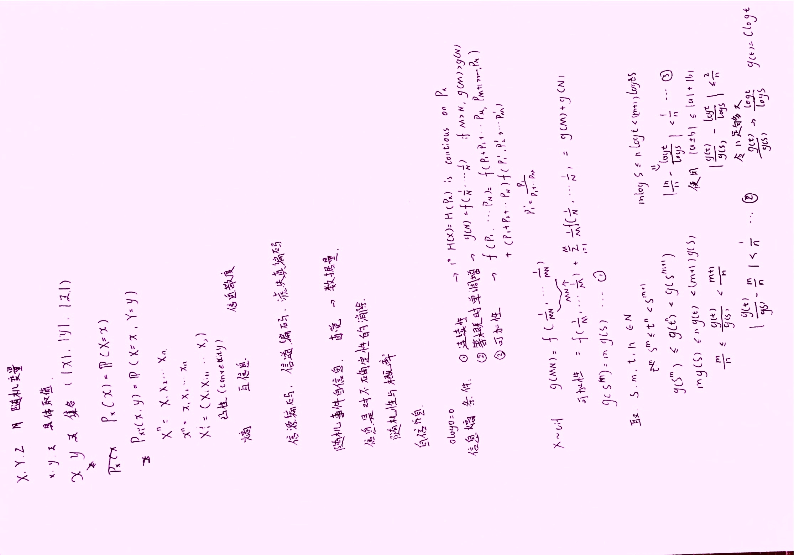
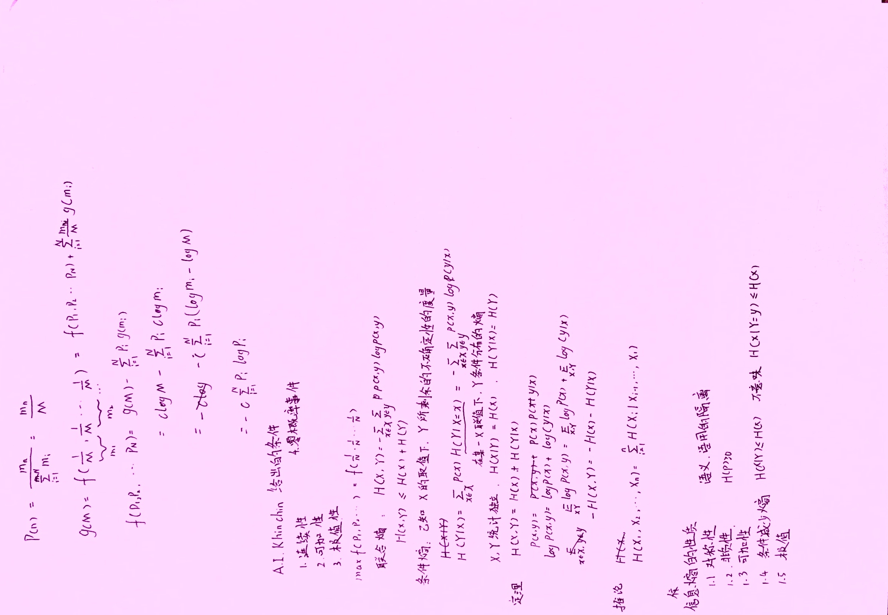
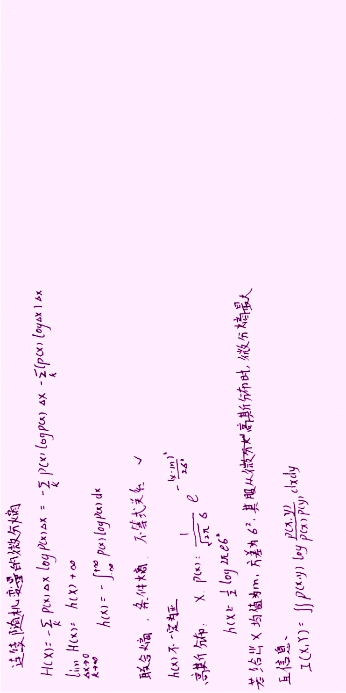
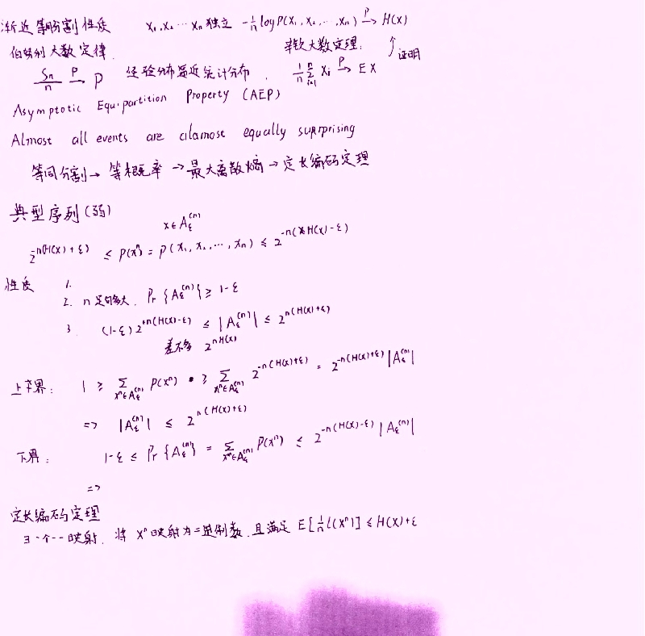
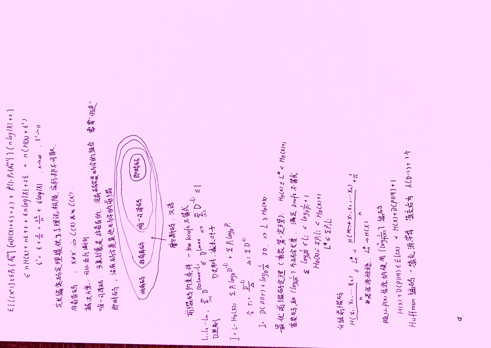
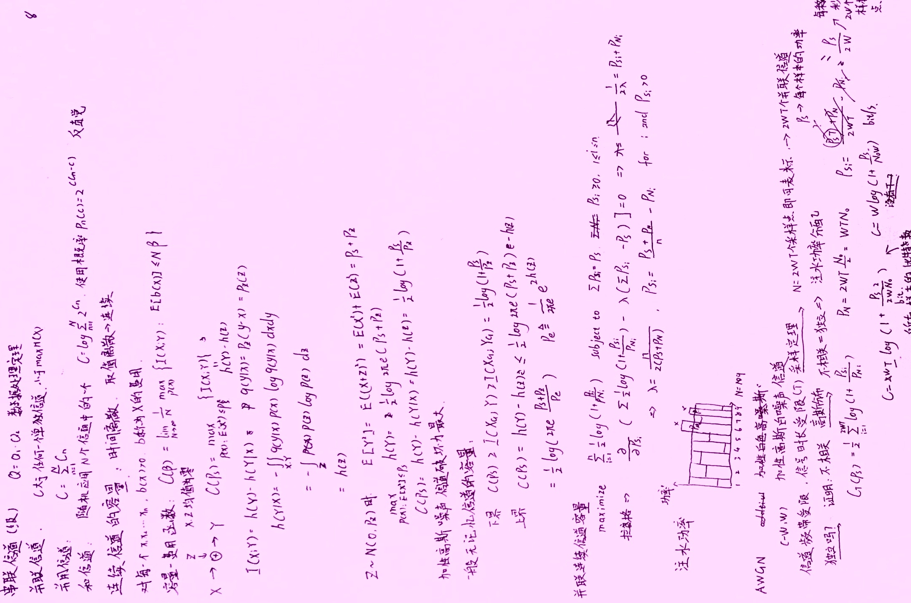
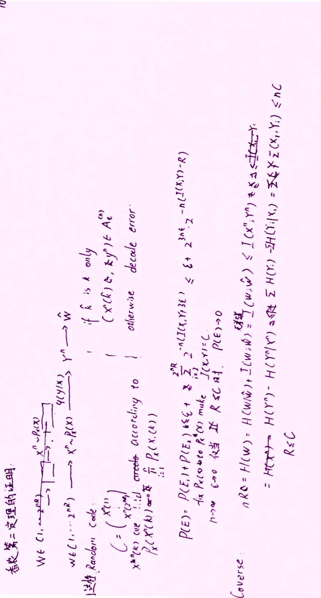

# 信息论

## 绪论

### 信息的基本概念

三大要素：物质，能量，信息

通信的基本问题：在一点精确的或近似地恢复另一点的信息

通信系统三项指标：
1. 有效性：快
2. 可靠性：准，误码率低
3. 安全性

三项指标对应的技术：
1. 数据压缩
2. 数据纠错
3. 数据加密

### 研究内容

通信系统是从空间的一点到另一点传送信息的， 而存储系统是从时间的一点到另一点传送信息的

模型：
1. 信源
   1. 离散信源
   2. 连续信源
      1. 离散时间连续信源
      2. 模拟信源
2. 编码器
   1. 信源编码器：提高传输有效性
   2. 信道编码器：提高传输可靠性
   3. 调制器：将符号变成适合信道传输的信号
3. 信道
   1. 无噪声
   2. 有噪声
      1. 加性
      2. 乘性
   3. 按离散还是连续，按有记忆还是无记忆
4. 译码器：解调器，信道译码器，信源译码器
5. 信宿

性能评价：
1. 有效性：频谱利用率
2. 可靠性：传输错误率
3. 安全性：加密强度

### shannong信息论

一个概念，三个定理

信息熵的概念

定理：
1. 无失真信源编码定理：$R \ge H$
2. 有噪信道编码定理：$R \le C$
3. 限失真信源编码定理：$R \ge R(D) \Leftrightarrow$存在平均失真$\le D$

## 离散信息的度量

### 自信息和互信息

#### 自信息

$$I(x) = -log(p(x))$$

意义：事件发生前：事件发生的不确定性，事件发生后：事件包含的信息量

$$I(xy) = -log(p(xy))$$

在$y = b_i$给定下：

$$I(x|y) = -log(p(x|y)) = I(xy) - I(y)$$

#### 互信息

$$I(x;y) = log\frac{p(x|y)}{p(x)} = I(x) - I(x|y) = I(y;x)$$

表示当$y$发生后，$x$不确定性的变化，反映两个随机事件$x,y$之间的统计关联程度

$$I(x;y|z) = log(\frac{p(x|yz)}{p(x|z)})$$

### 信息熵

$$H(X) = E[I(x)] = -\sum_x p(x)logp(x)$$

信源输出前：信源的的平均不稳定性，输出后：一个信源符号所提供的平均信息量

有根概率树：

$$H(X) = \sum_i q(u_i)H(u_i)$$

条件熵：

$$H(Y|X) = -\sum_x p(x)H(Y|x)$$

式中$H(Y|x)$为取某一值是$Y$的熵，$H(Y|x) = -\sum_y p(y|x)log p(y|x)$

联合熵：

$$H(XY) = -\sum_x \sum_y p(xy)log p(xy)$$

散度：

$$D(P//Q) = \sum_x P(x)log \frac{P(x)}{Q(x)} \ge 0$$

熵的基本性质：
1. 对称，非负，扩展，可加
2. 极值性（离散最大熵定理）：$H(X) \le log n$，散度定理可证
3. 上凸性，确定性

各类熵之间的关系：

$$H(Y|X) \le H(Y)$$

$$H(X_1 X_2 \cdots X_N) \le H(X_1)H(X_2)\cdots H(X_N)$$

### 平均互信息

集合与事件：

$$I(x;Y) = \sum_y p(y|x) log \frac{p(y|x)}{p(y)}$$

集合于集合：

$$I(X;Y) = \sum_{x,y} p(xy) I(x;y)$$

平均互信息与熵的关系：

$$I(X;Y) = H(X) - H(X|Y) = H(X)+H(Y)-H(XY)$$

性质：
1. 非负，对称
2. 极值：$I(X;Y) \le H(X) and H(Y)$
3. 为$p(x)$的上凸函数，$p(y|x)$的下凸函数

## 离散信源

### 分类与模型

分类：按符号取值，按符号间依赖关系，状态集合是否有限，是否平稳

离散无记忆信源数学模型：

$$\begin{bmatrix}
      X \\
      P \\
\end{bmatrix} = \begin{bmatrix}
      a_1 & a_2 & \dotsb & a_n \\
      p(a_1) & p(a_2) & \dotsb & p(a_n)\\
\end{bmatrix}$$

多维，N次扩展源

离散有记忆信源：

马氏信源

### 离散无记忆信源的熵

单符号性质：
1. 上凸函数：$p = 0.5$时，最大
2. 具有熵的一切性质

N次扩展熵：

$$H(X^N) = NX(X)$$

### 离散平稳信源的熵

统计特性，条件概率，信息熵，条件熵与时间的推移无关

#### 离散有记忆平稳信源：

$$H(X^N) \le NH(X_1)$$

平均符号熵：
$$H_N(X) = \frac{1}{N} H(X^N)$$

极限符号熵：
$$H_\infty = \lim_{N \rightarrow \infty}H_N(X)$$

性质：
1. $H(X_N|X_1X_2\cdots X_{N-1}) \ge H(X_{N+1}|X_1X_2\cdots X_{N})$
2. $H_N(X) \ge H(X_N|X_1X_2\cdots X_{N-1})$
3. $H_N(X) \ge H_{N+1}(X)$
4. $H_\infty(X) = H(X_N|X_1X_2\cdots X_{N-1})$

### 有限状态马尔可夫链

时间离散，状态离散，n阶马氏链只与前n个状态有关

状态转移概率：

$$p(x_n = j|x_m = i) = p_{ij}(m,n)$$

齐次（平稳）k步，一步时省略k：

$$p_{ij}^{(k)}$$

表示方法：转移概率图，网格图，状态转移图

*kolmogorov-chapman*方程：

$$p^{(k)} = p^{(0)}P^k$$

分类：常返态，过渡态
若常返态$\{n:n\le 1 ,p_{ii}^{n} > 0\}$的最大公约数为$d_i$，$d_i = 1$遍历，$d_i > 1$周期
同一类所有周期相等

马氏链的平稳分布：

$$\pi^T = \pi^T P$$

$$\lim_{k \rightarrow \infty} P^k = e\pi^T$$

对于有限状态的马氏链，平稳分布恒存在，有几个遍历常返类就有几个解，对于只有周期常返类的马氏链，上式不收敛

### 马尔可夫信源

当前时刻输出符号只与当前时刻状态有关

产生模型

#### 马氏链N次扩展源的计算

对于m阶的起始状态平稳马氏链：

$$H(X_1X_2 \cdots X_N) = H([\pi]) + (N-m)[\pi]^T[h]$$

式中$[h]$为转移概率每行的熵

若状态与符号一一对应：

$$H(X)_\infty = [\pi]^T[h]$$

否则：

$$H(X)_\infty = \sum_{i=1}^J \pi_iH(X|s=i)$$

式中$H(X|s=i) = -\sum_{i=1}^n p_j(a_i)log p_j(a_i)$

### 信源相关性与剩余度

相关性即信源符号间的依赖程度

信源效率：

$$\eta = \frac{H_\infty}{H_0}$$

剩余度：

$$\gamma = 1-\eta$$

式中$H_0 = logq$为符号独立等概时的信源熵

## 连续随机变量集合熵

连续信源熵两部分：绝对熵无限大，差熵为$h(X) = -\int p(x)log p(x) \mathrm{d} x$，单位为bit/自由度

条件熵：

$$h(X|Y) = -\iint p(xy) log p(x|y) \mathrm{d} x \mathrm{d} y$$

联合熵：

$$h(\boldsymbol{X}^N) = -\int p(\boldsymbol{x}) log p(\boldsymbol{x})$$

熵率（类似离散信源的极限符号熵）：

$$h(X) = \lim_{N\rightarrow \infty} \frac{h(X_1X_2\cdots X_N)}{N}$$

若$\boldsymbol{y} = \boldsymbol{A}\boldsymbol{x} + \boldsymbol{\alpha}$：

$$h(\boldsymbol{Y}^N) = h(\boldsymbol{X}^N) + log (det|\boldsymbol{A}|)$$

平均自信息：

$$I([X]_P;[Y]_Q) = \sum_{i,j} p(u_iv_j)log \frac{p(u_iv_j)}{p(u_i)q(v_j)}$$

$\boldsymbol{U}^N$，$\boldsymbol{V}^N$分别为$\boldsymbol{X}^N$，$\boldsymbol{Y}^N$的可逆线性变换，则

$$I(\boldsymbol{U}^N;\boldsymbol{V}^N) = I(\boldsymbol{X}^N;\boldsymbol{Y}^N)$$

### 离散时间高斯信源的熵

N维独立：

$$h(\boldsymbol{X}) = \frac{N}{2} log[2\pi e (\sigma_1^2 \sigma_2^2\cdots \sigma_n^2)^{\frac{1}{N}}]$$

### 最大熵定理

限峰值：最大为均匀分布时，$\sum_{i = 1}^N log(b_i-a_i)$
限功率：最大为高斯分布

## 无失真信源编码

信源编码：将信源符号序列按一定的数学规律映射成由码符号组成的码序列的过程

目的：提高传输有效性

分类：
1. 概率匹配编码，按信源序列和编码器输出的关系
   1. 分组码，变/定长，奇异/非奇异，即时/非即时，异前置码，逗号码
   2. 非分组码
   
2. 通用编码

### 定长码

无失真编码条件: $q^N \le r^l$

#### 信源序列分组定理：

$$|\frac{1}{N}log p(x) + H(X)| < \delta$$

$N \ge N_0 = \frac{\sigma^2}{\varepsilon \delta^2}$，且满足上式的序列称为典型序列

典型序列概率：$p(x) = 2^{-N(H(X)\pm \delta)}$
个数：$(1-\varepsilon)2^{N(H(X)-\delta)} < N_G < 2^{N(H(X)+\delta)}$
渐进均分特性

#### 定长码信源编码定理

定长码信源编码定理（N足够大时，只保证典型序列不失真）：

$$r^l \ge 2^{N(H(X)+\delta)} \Rightarrow r\frac{l}{N}log r \ge H(X)+\delta$$

编码速率（编码后一个信源符号代表的最大信息量）：$R' = \frac{l logr}{N}$，单位（比特/信源符号）
编码效率：$\eta = \frac{H(X)}{R'} = \frac{NH((X))}{l logr}$
信息传输效率：$R =  \frac{NH((X))}{l}$，当$r = 2$时，与编码效率数值相等，单位（比特/码符号）
无失真编码：$R' > H(X)$
编码效率与熵：$N \ge \frac{\sigma^2}{\varepsilon \delta^2}$，其中$\delta = \frac{1-\eta}{\eta}H(X)$

### 变长码

异前置码性质（用码树描述可推）：*Kraft*定理

$$\sum_{i = 1}^q r^{-l_i} \le 1$$

也是唯一可译码的条件，任意唯一可译码可转化为异前置码

单信源符号平均码长：$\bar{l} = \sum_{k = 1}^q p_k l_k$

N次扩展源：$\bar{l} = \frac{1}{N}\sum_{k = 1}^q p_k l_k$

#### 变长码信源编码定理

单信源符号：

$$\frac{H(X)}{log r} \le \bar{l} < \frac{H(X)}{log r}+1$$

shannong第一定理：任意信源X的，N次扩展源编码，N足够大时，$\bar{l}$可任意接近$H_r(X)$

### huffman编码

对于存在最优编码的信源，其最少有两个码长相同的码，仅最后一位不同

尽量高位合并，减少码长方差，减少码长缓冲器容量

$r$元huffman编码时，以$s = r+(r-1)m$，来增补零概率符号

马氏源编码：以转移概率进行编码比平稳分布编码效率高

### 算术编码

积累概率：
1. 单信源符号：$P(a_k) = \sum_{i=1}^{k-1} p_i$
2. 信源符号序列：对同长度的序列小的概率求和

编码：

$$L_{j+1} = L_j + \triangle_j P(j+1)$$

译码：

$$(c-L_{j-1})/\triangle_{j-1} ?> P(x=1)$$

## 离散信道及其容量

### 概述

分类：
1. 按输入，输出取值分类：离散，连续，半离散，时间离散连续
2. 按输入，输出个数：单用户，多用户
3. 按转移概率性质分：
   1. 无噪声信道：无损信道（一对多），确定信道（多对一），无扰信道（一对一）
   2. 有噪声信道：无记忆信道，有记忆信道

4. 按信道统计特性分：恒参信道，变参信道
5. 按信道噪声性质分：高斯噪声信道，非高斯噪声信道

数学模型：离散无记忆信道，平稳信道，单符号离散信道

信道容量：
1. 单符号离散信道：$C = max_{p(x)}I(X;Y)$
2. 多维矢量信道：$C = max_{p(x_1x_2\cdots x_N)}I(X^N;Y^N)$

### 单符号离散信道及其容量

离散无噪声信道：$r$为输入符号集的大小，$s$为输出符号集的大小
1. 无损信道：$C = log r$
2. 确定信道：$C = log s$
3. 无扰信道：$C = log r = log s$

离散对称信道：输入等概率时达到信道容量

$$C = H(Y) - H(p_{11},p_{12},\cdots ,p_{1s})$$

对于强对称信道：

$$C = log s - H(p_{11},p_{12},\cdots ,p_{1s})$$

一般离散信道：
1. 转移概率矩阵逆$P^{-1}$存在时：

$$C = log_2 \sum_{k = 1}^r 2^{\beta_k}$$

式中$\beta = -P^{-1}h$

2. 离散无记忆信道：

$$I(a_i;Y) = C \qquad ,p_i > 0$$

$$I(a_i;Y) \le C \qquad ,p_i = 0$$

信道级联：信息丢失

离散无记忆信道：

$$I(\boldsymbol{X}^N;\boldsymbol{Y}^N) \le \sum_{i = 1}^N (\boldsymbol{X_i};\boldsymbol{Y_i})$$

无记忆信源：

$$I(\boldsymbol{X}^N;\boldsymbol{Y}^N) \le \sum_{i = 1}^N (\boldsymbol{X_i};\boldsymbol{Y_i})$$

## 1. 信息论基本概念

## 2. 信源与信源无失真编码

## 3. 信道及其容量

